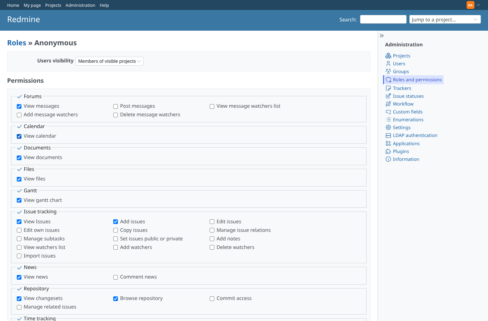
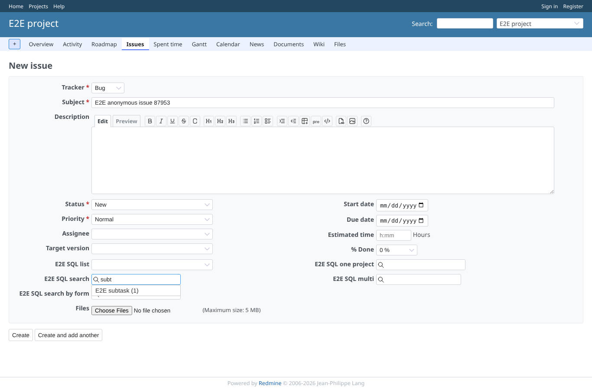
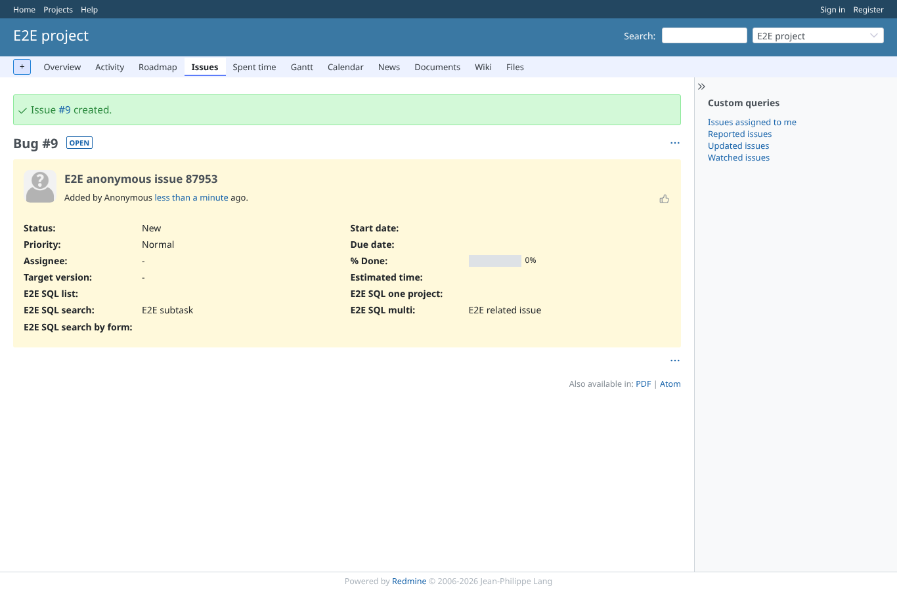
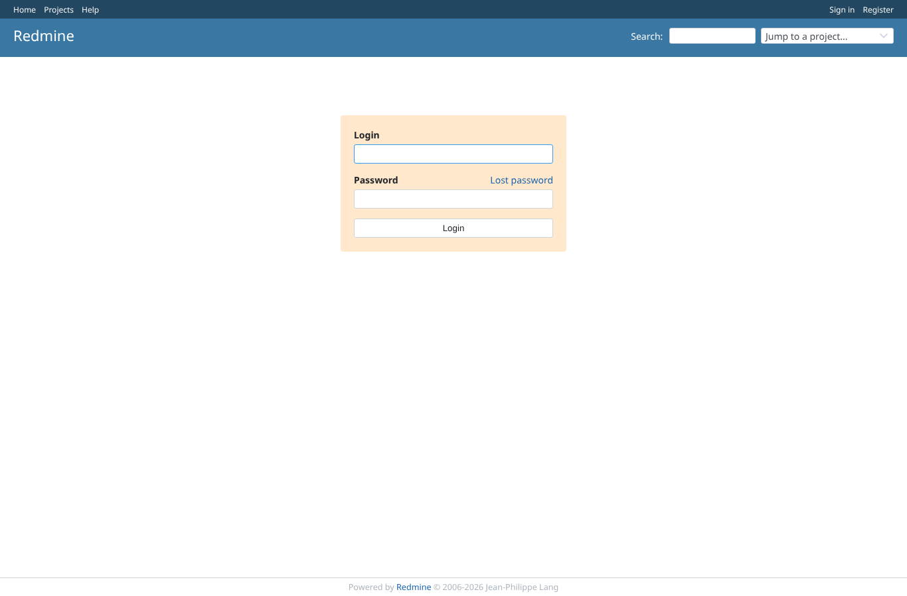
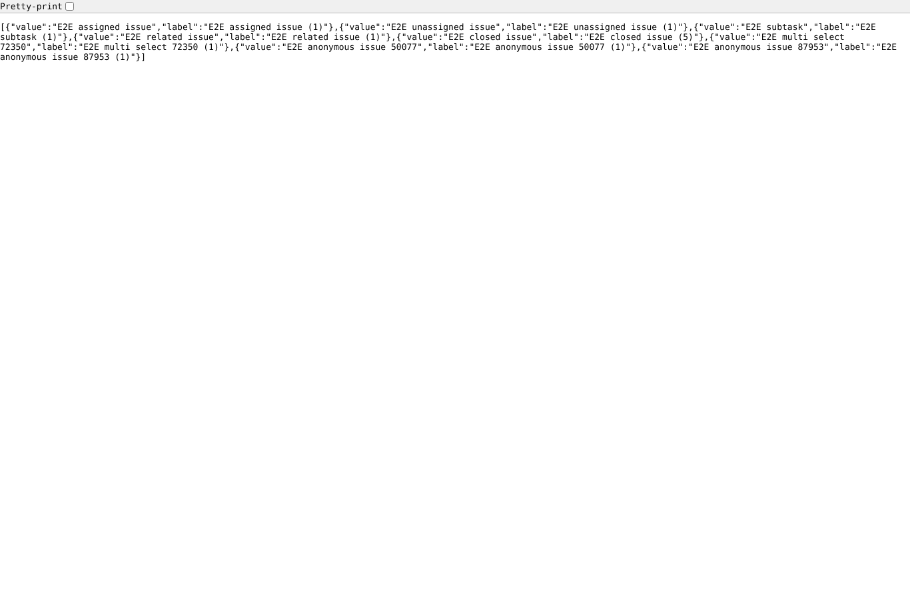
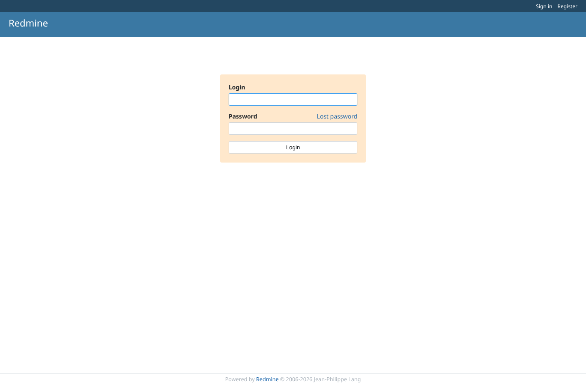

# anonymous_search

Run 2026-10-07T19:46:48.242Z against http://127.0.0.1:3000.

| screenshot | user | URL | shows |
|---|---|---|---|
|  | anonymous | `/login?back_url=http%3A%2F%2F127.0.0.1%3A3000%2Fprojects%2Fe2e-project%2Fissues%2Fnew` | Anonymous, the anonymous role without "Add issues": the new issue form sends to the login form, the search answers HTTP 401 |
|  | admin | `/roles/2/edit` | Administration > Roles and permissions > Anonymous: "Add issues" ticked (all trackers) and saved |
|  | anonymous | `/projects/e2e-project/issues/new` | Anonymous on the new issue form of public e2e-project: typing "subt" lists E2E subtask (1) |
|  | anonymous | `/issues/9` | Anonymous created an issue with E2E SQL search = E2E subtask and E2E SQL multi = E2E related issue, both picked from the suggestions |
|  | anonymous | `/login?back_url=http%3A%2F%2F127.0.0.1%3A3000%2Fcustom_sql_search%2Fsearch%3Fproject_id%3De2e-project%26custom_field_id%3D2%26term%3De2e%26issue_id%3D1` | Anonymous with "Add issues": private e2e-private HTTP 401, issue #1 (anonymous may not edit it) HTTP 401; opened as a page it sends to the login form |
|  | reporter | `/custom_sql_search/search?project_id=e2e-project&custom_field_id=2&term=e2e` | Reporter: the search answers JSON (8 rows) on e2e-project, HTTP 403 on e2e-private |
|  | anonymous | `/login?back_url=http%3A%2F%2F127.0.0.1%3A3000%2Fcustom_sql_search%2Fsearch%3Fproject_id%3De2e-project%26custom_field_id%3D2%26term%3De2e` | Settings > Authentication > "Authentication required" on: anonymous gets HTTP 401 and the login form, even with "Add issues" |
|  | anonymous | `/login?back_url=http%3A%2F%2F127.0.0.1%3A3000%2Fcustom_sql_search%2Fsearch%3Fproject_id%3De2e-project%26custom_field_id%3D2%26term%3De2e` | "Add issues" removed from the anonymous role again: the search answers HTTP 401 (login form as a page) |
