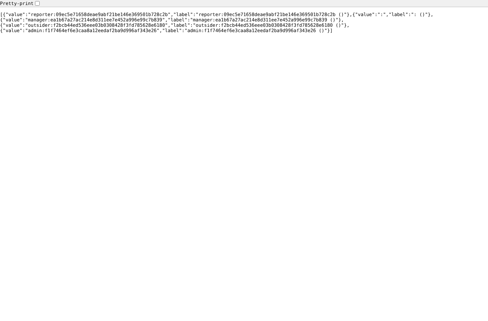
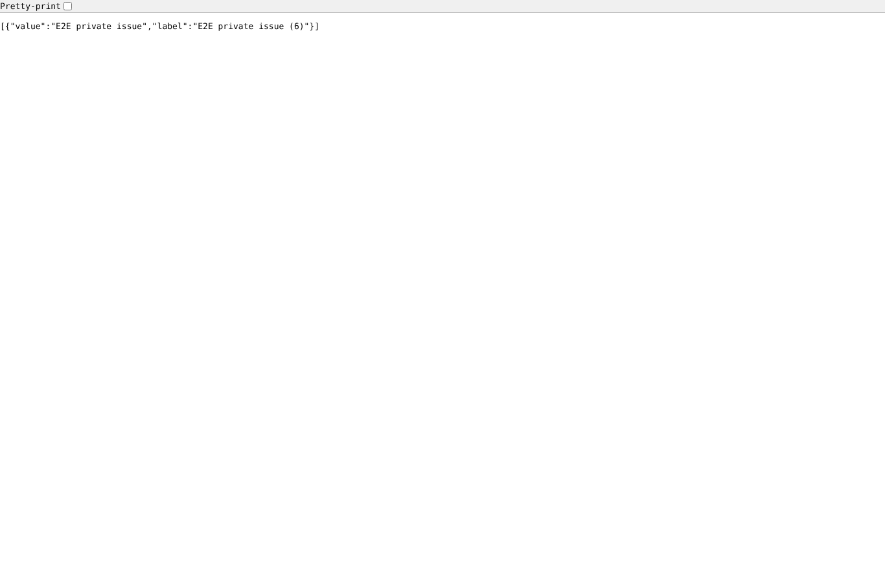
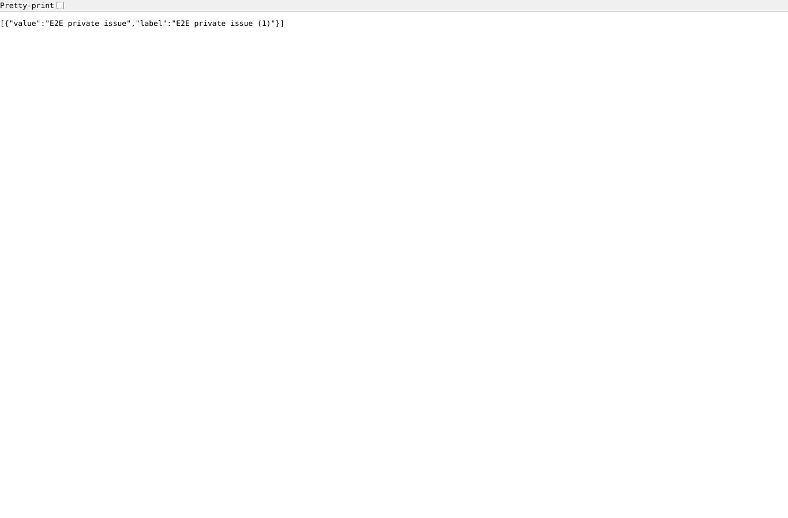
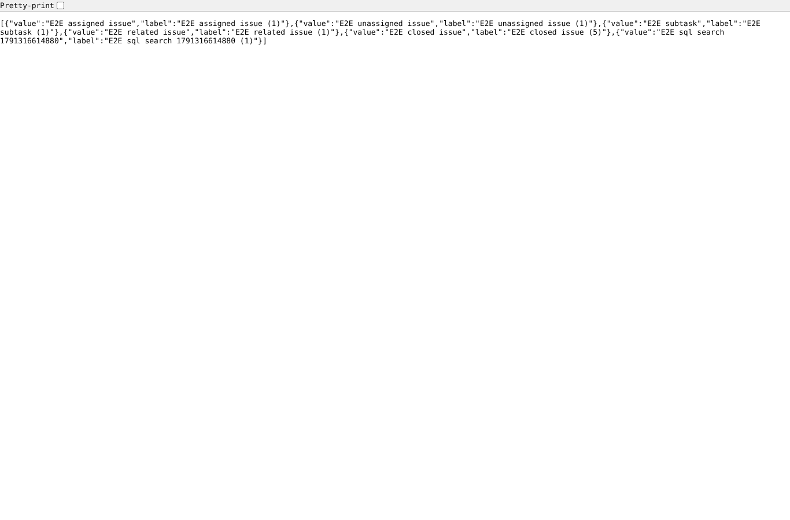

# search_authorization

Run 2026-10-06T19:59:07.996Z against http://127.0.0.1:3001.

| screenshot | user | URL | shows |
|---|---|---|---|
|  | manager | `/custom_sql_search/search?custom_field_id=2&project_id=1&issue_id=&term=E2E` | Manager, field "E2E SQL search", term E2E: the subjects of e2e-project only (XHR: HTTP 200, 6 rows; page: HTTP 200) |
|  | manager | `/custom_sql_search/search?custom_field_id=2&project_id=1&issue_id=&term=zzz%27%29+union+select+login+%7C%7C+%27%3A%27+%7C%7C+hashed_password%2C+null+from+users+--` | Manager, a term that closes the quote and adds a UNION over every login and password hash (the request that leaked them before): no rows, the term stays text (XHR: HTTP 500, undefined rows; page: HTTP 500) |
|  | manager | `/custom_sql_search/search?custom_field_id=2&project_id=1&issue_id=&term=x%25%27%29+or+1%3D1+or+%28%27` | Manager, field "E2E SQL search", term `x%') or 1=1 or ('`: no rows (XHR: HTTP 500, undefined rows; page: HTTP 500) |
|  | manager | `/custom_sql_search/search?custom_field_id=3&project_id=1&issue_id=&term=E2E&p0=zzz%27+union+select+login+%7C%7C+%27%3A%27+%7C%7C+hashed_password%2C+null+from+users+--` | Manager, form parameter p0 that closes the quote and adds a UNION over every login and password hash (test users): no rows (XHR: HTTP 200, 5 rows; page: HTTP 200) |
|  | manager | `/custom_sql_search/search?custom_field_id=4&project_id=1&issue_id=&term=man` | Manager, field visible to "E2E full" only: allowed (XHR: HTTP 200, 1 rows; page: HTTP 200) |
|  | manager | `/custom_sql_search/search?custom_field_id=5&project_id=2&issue_id=&term=E2E` | Manager, field enabled for e2e-project only, asked for e2e-private: refused (XHR: HTTP 200; page: HTTP 200) |
|  | manager | `/custom_sql_search/search?custom_field_id=1&project_id=1&issue_id=&term=E2E` | Manager, the id of an "sql" list field: not found (XHR: HTTP 500; page: HTTP 500) |
|  | manager | `/custom_sql_search/search?custom_field_id=2&project_id=999999&issue_id=&term=E2E` | Manager, a project that does not exist: not found (XHR: HTTP 200; page: HTTP 200) |
|  | reporter | `/custom_sql_search/search?custom_field_id=2&project_id=1&issue_id=&term=E2E` | Reporter (core role with add issues), field "E2E SQL search": allowed (XHR: HTTP 200, 6 rows; page: HTTP 200) |
|  | reporter | `/custom_sql_search/search?custom_field_id=4&project_id=1&issue_id=&term=man` | Reporter, field visible to "E2E full" only: refused (XHR: HTTP 200; page: HTTP 200) |
|  | reporter | `/custom_sql_search/search?custom_field_id=2&project_id=1&issue_id=6&term=E2E` | Reporter, issue_id of private issue #6: not found (XHR: HTTP 200; page: HTTP 200) |
|  | outsider | `/custom_sql_search/search?custom_field_id=2&project_id=2&issue_id=&term=E2E` | Outsider, private project e2e-private: refused (XHR: HTTP 200; page: HTTP 200) |
|  | outsider | `/custom_sql_search/search?custom_field_id=2&project_id=1&issue_id=&term=E2E` | Outsider on public e2e-project (core role "Non member" may add issues): allowed (XHR: HTTP 200, 6 rows; page: HTTP 200) |
|  | anonymous | `/custom_sql_search/search?custom_field_id=2&project_id=1&issue_id=&term=E2E` | Anonymous (login not required in the settings): XHR HTTP 200, the page sends to the login form |

## Problems

- injection-term: XHR HTTP 500, expected 200: {"status":500,"error":"Internal Server Error"}
- injection-term: unexpected body {"status":500,"error":"Internal Server Error"}
- injection-quote: XHR HTTP 500, expected 200: {"status":500,"error":"Internal Server Error"}
- injection-quote: unexpected body {"status":500,"error":"Internal Server Error"}
- injection-form-param: unexpected body [{"value":"reporter:09ec5e71658deae9abf21be146e369501b728c2b","label":"reporter:09ec5e71658deae9abf21be146e369501b728c2b ()"},{"value":":","label":": ()"},{"value":"manager:ea1b67a27ac214e8d311ee7e452a996e99c7b839","label":"manager:ea1b67a27ac214e8d311ee7e452a996e99c7b839 ()"},{"value":"outsider:f2b
- field-not-in-project: XHR HTTP 200, expected 403: [{"value":"E2E private issue","label":"E2E private issue (6)"}]
- not-sql-search: XHR HTTP 500, expected 404: {"status":500,"error":"Internal Server Error"}
- unknown-project: XHR HTTP 200, expected 404: []
- reporter-hidden-field: XHR HTTP 200, expected 403: [{"value":"manager","label":"manager (E2E)"}]
- reporter-private-issue: XHR HTTP 200, expected 404: [{"value":"E2E assigned issue","label":"E2E assigned issue (1)"},{"value":"E2E unassigned issue","label":"E2E unassigned issue (1)"},{"value":"E2E subtask","label":"E2E subtask (1)"},{"value":"E2E rel
- outsider-private: XHR HTTP 200, expected 403: [{"value":"E2E private issue","label":"E2E private issue (1)"}]
- anonymous XHR: HTTP 200
- anonymous page: not sent to login (http://127.0.0.1:3001/custom_sql_search/search?custom_field_id=2&project_id=1&issue_id=&term=E2E)
