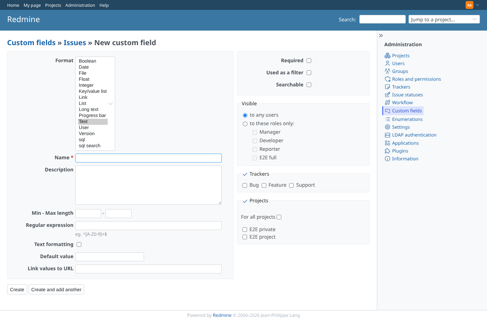
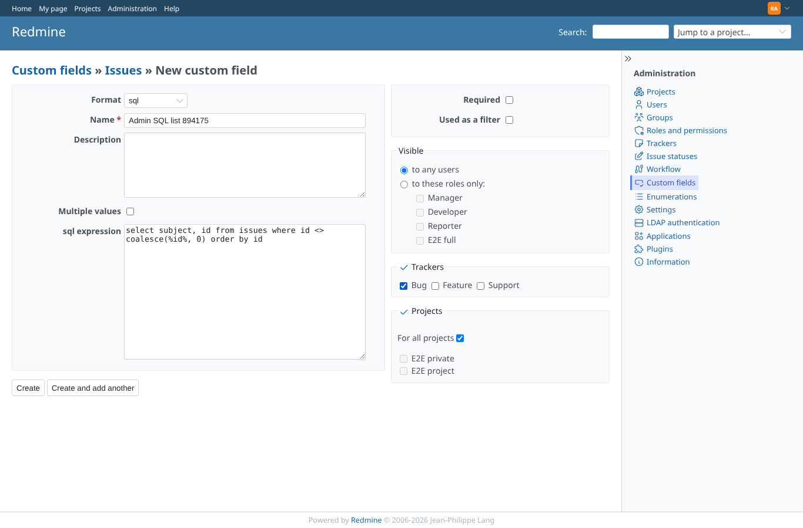
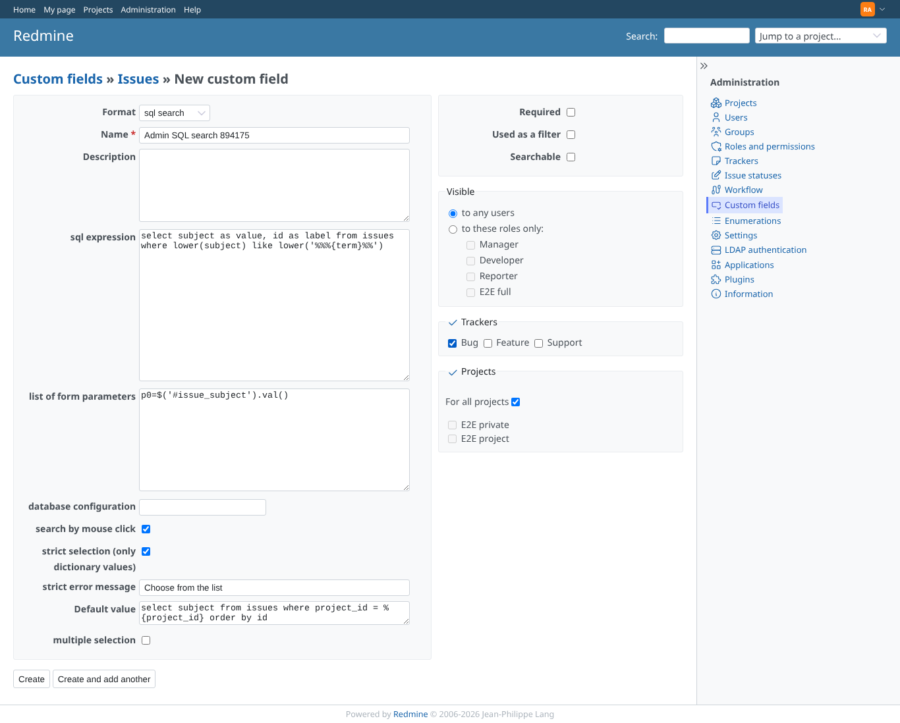
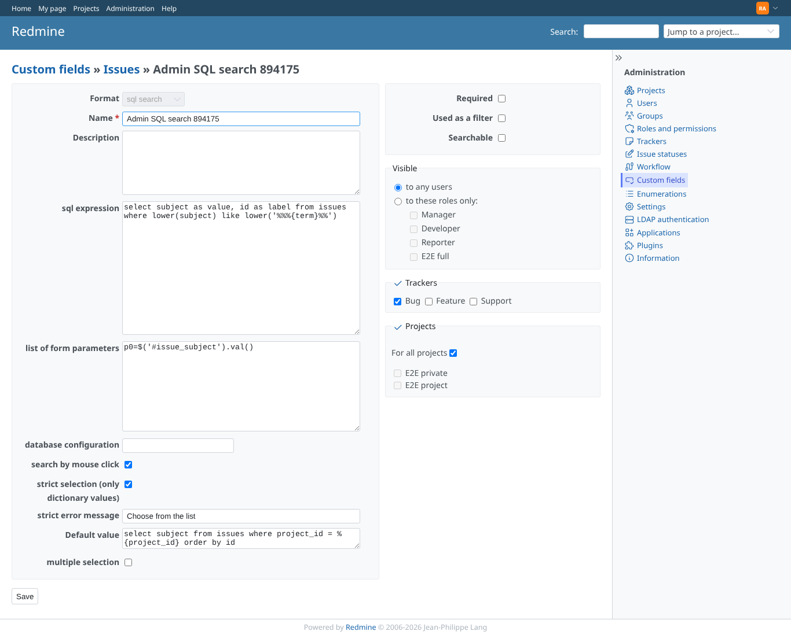
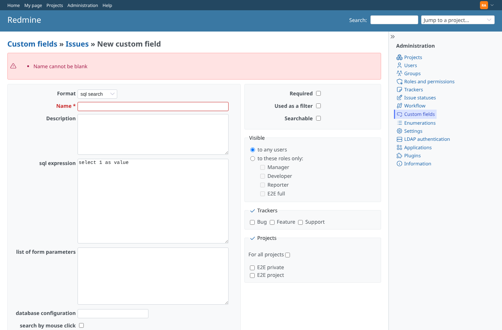

# custom_field_admin

Run 2026-10-07T19:55:37.624Z against http://127.0.0.1:3000.

| screenshot | user | URL | shows |
|---|---|---|---|
|  | admin | `/custom_fields/new?type=IssueCustomField` | The format list offers "sql" and "sql search" (15 formats) |
|  | admin | `/custom_fields/new?type=IssueCustomField&custom_field[field_format]=sql` | New issue field, format "sql": the sql expression is the only plugin setting |
|  | admin | `/custom_fields/new?type=IssueCustomField&custom_field[field_format]=sql_search` | New issue field, format "sql search": sql expression, form parameters, database configuration, search by click, strict selection, message and default value query |
|  | admin | `/custom_fields/11/edit` | The saved sql search field: every plugin setting reads back as entered |
|  | admin | `/custom_fields` | Saving without a name is refused ("Name cannot be blank") and the sql expression is kept |
|  | manager | `/custom_fields` | Manager (every project permission, not an administrator): Administration > Custom fields is refused |
