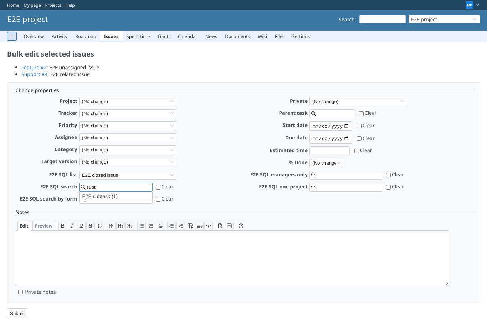
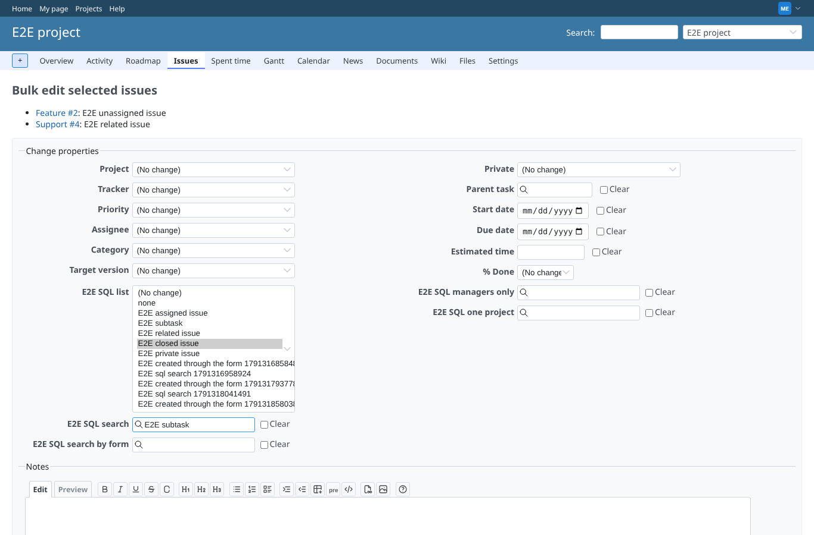
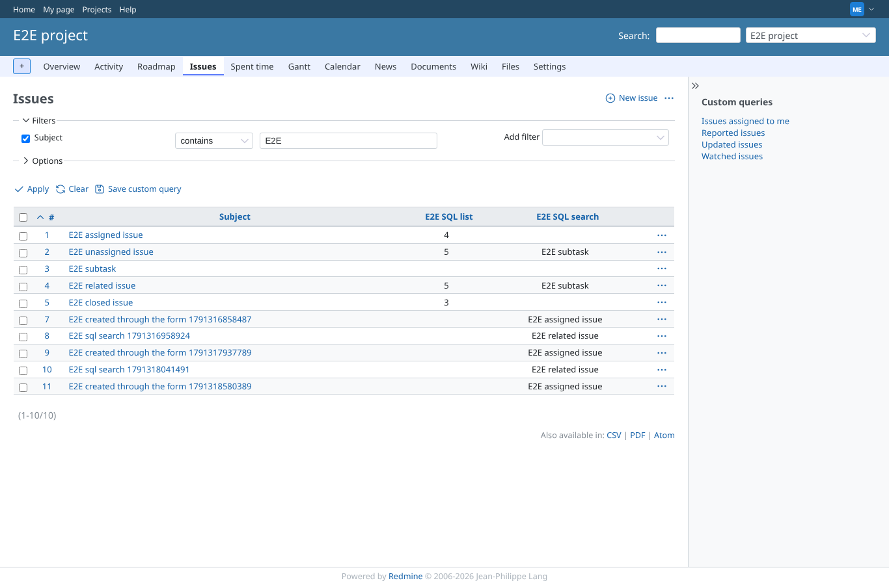

# bulk_edit

Run 2026-10-06T20:29:55.893Z against http://127.0.0.1:3002.

| screenshot | user | URL | shows |
|---|---|---|---|
|  | manager | `/issues/bulk_edit?ids%5B%5D=2&ids%5B%5D=4` | Bulk edit of 2 issues: the sql list offers its options (picked "E2E closed issue" = 5) and the sql search lists "E2E subtask (1)" |
|  | manager | `/issues/bulk_edit?ids%5B%5D=2&ids%5B%5D=4` | Bulk edit: the options of the sql list, "E2E closed issue" selected; "E2E subtask" picked in the sql search |
|  | manager | `/projects/e2e-project/issues?set_filter=1&f[]=subject&op[subject]=~&v[subject][]=E2E+&c[]=subject&c[]=cf_1&c[]=cf_2&sort=id` | Both issues now have "E2E subtask" in E2E SQL search and 5 in E2E SQL list |
