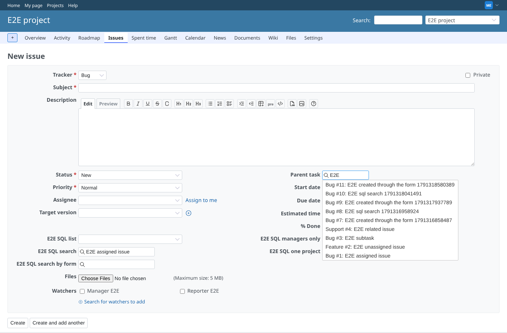
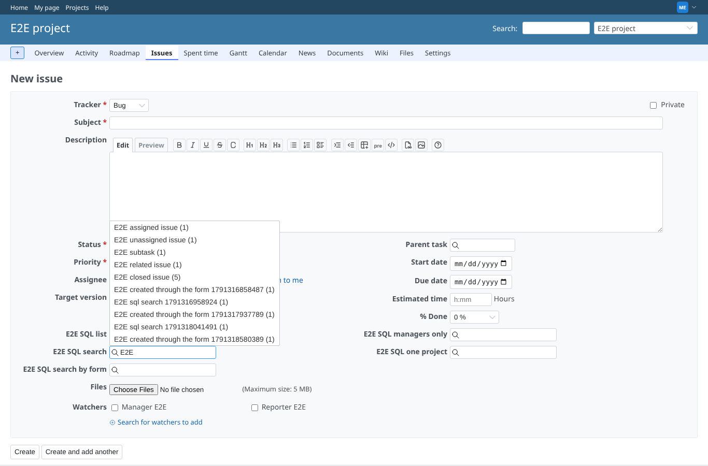

# css_scope

Run 2026-10-06T20:30:00.378Z against http://127.0.0.1:3002.

| screenshot | user | URL | shows |
|---|---|---|---|
|  | manager | `/projects/e2e-project/issues/new` | Core parent task list: class "ui-menu ui-widget ui-widget-content ui-autocomplete ui-front", max-height none: not touched by the plugin |
|  | manager | `/projects/e2e-project/issues/new` | Plugin list: class "ui-menu ui-widget ui-widget-content ui-autocomplete sql-autocomplete ui-front", max-height 300px, overflow-y auto |
