# multi_select

Run 2026-10-07T19:56:22.608Z against http://127.0.0.1:3000.

| screenshot | user | URL | shows |
|---|---|---|---|
| 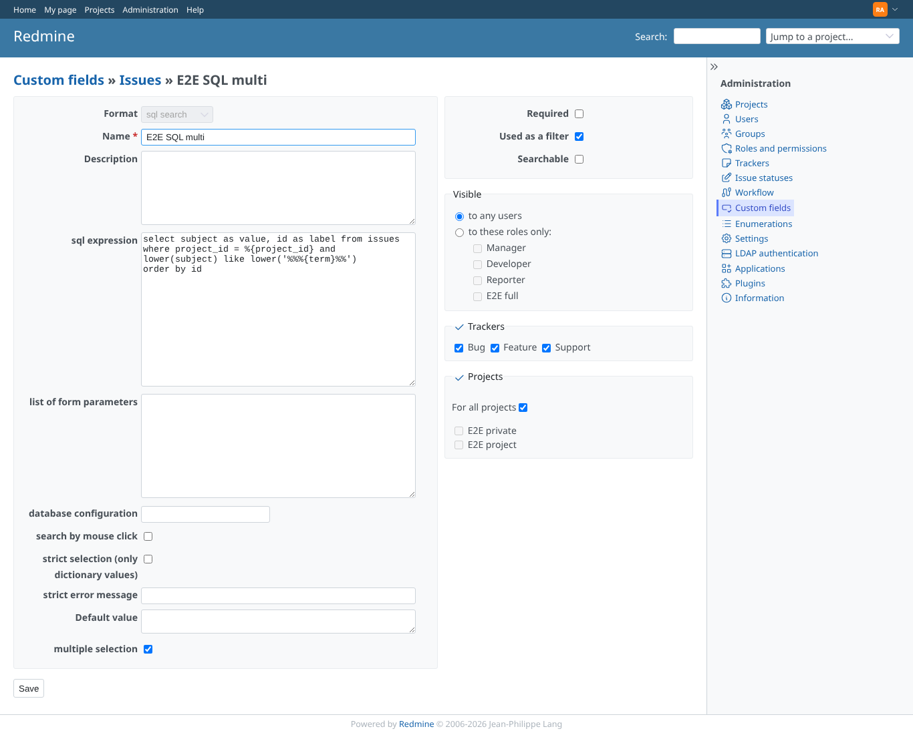 | admin | `/custom_fields/6/edit` | Administration > Custom fields > E2E SQL multi: the new setting "Multiple selection" (checked), under the other sql search settings |
| 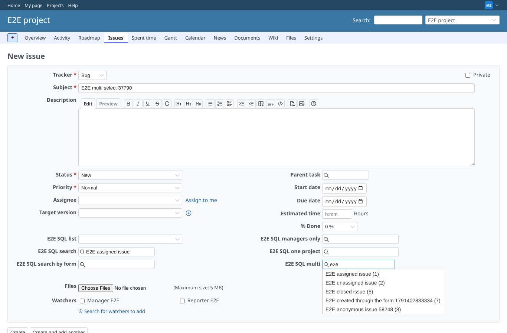 | manager | `/projects/e2e-project/issues/new` | New issue: "E2E subtask" and "E2E related issue" picked as tags; typing "e2e " offers the other issues only: E2E assigned issue (1) | E2E unassigned issue (2) | E2E closed issue (5) | E2E created through the form 1791402833334 (7) | E2E anonymous issue 58248 (8) |
| 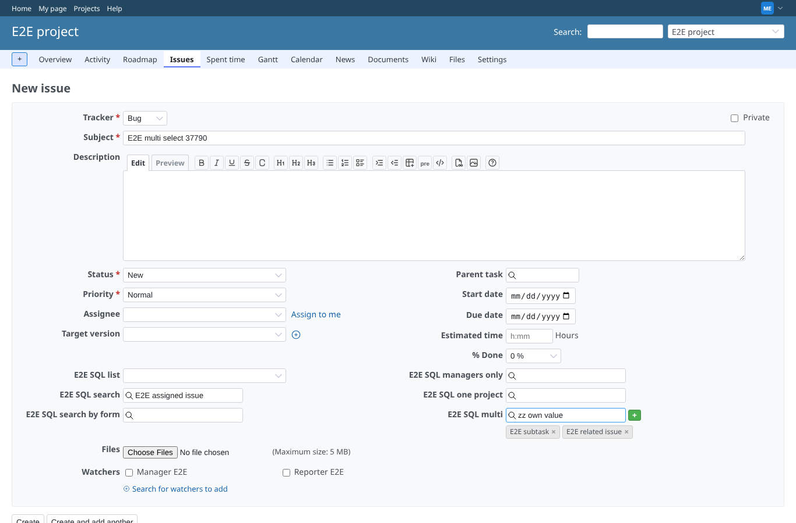 | manager | `/projects/e2e-project/issues/new` | Strict selection off: "zz own value" has no result, the green "+" (title "Add") adds it |
| 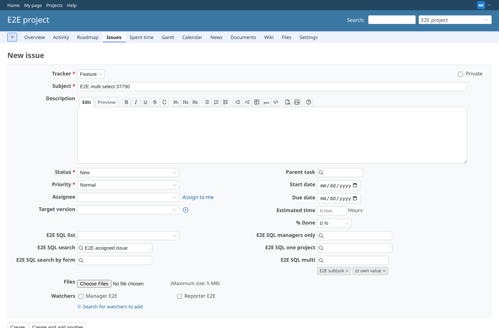 | manager | `/projects/e2e-project/issues/new` | After removing "E2E related issue" and switching the tracker (the form is rebuilt): tags E2E subtask, zz own value; stored ["E2E subtask","zz own value"] |
| 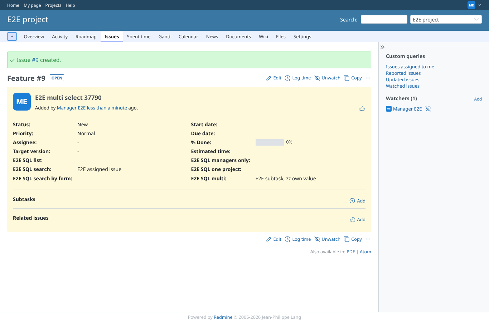 | manager | `/issues/9` | Created /issues/9: E2E SQL multi shows "E2E subtask, zz own value" (stored as ["E2E subtask","zz own value"]) |
| 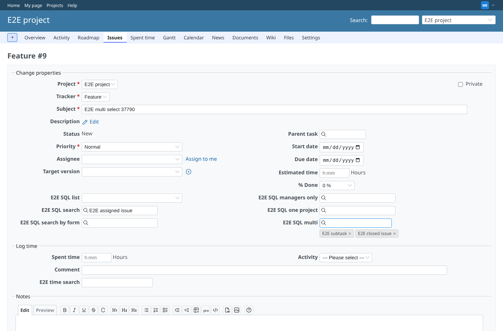 | manager | `/issues/9/edit` | Edit form: the saved values come back as tags; "zz own value" removed, "E2E closed issue" added |
| 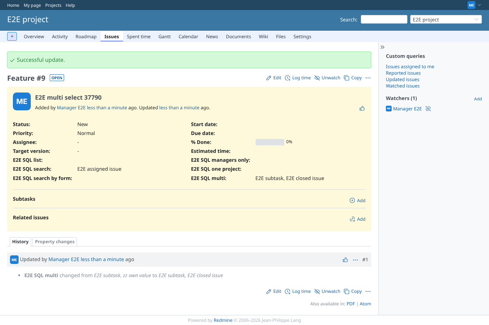 | manager | `/issues/9` | Sent with form.submit() (no submit event, the way IssueHotButton sends it): E2E SQL multi = "E2E subtask, E2E closed issue" |
| 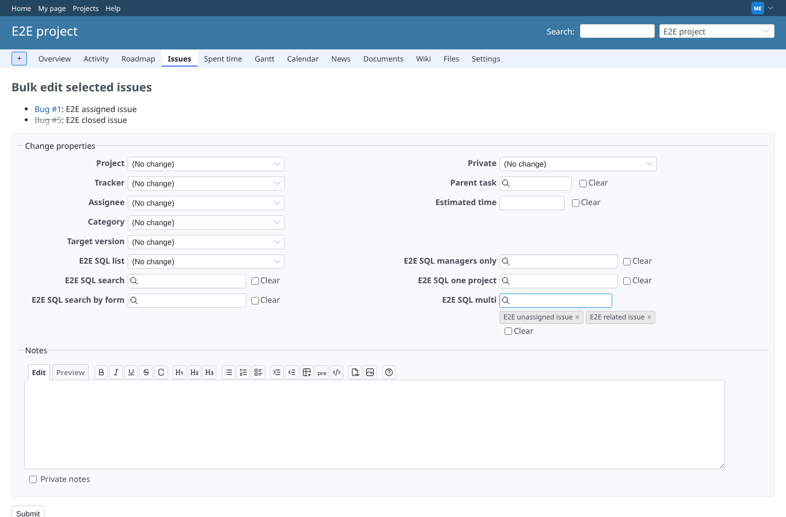 | manager | `/issues/bulk_edit?ids%5B%5D=1&ids%5B%5D=5` | Bulk edit of 2 issues: tags E2E unassigned issue, E2E related issue |
| 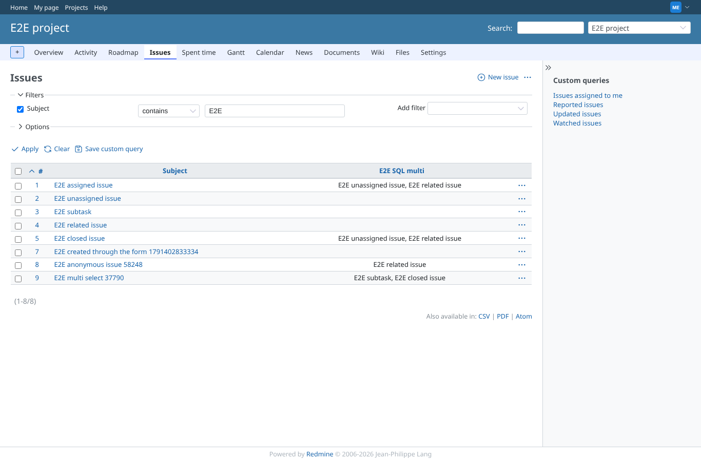 | manager | `/projects/e2e-project/issues?set_filter=1&f[]=subject&op[subject]=~&v[subject][]=E2E+&c[]=subject&c[]=cf_6&sort=id` | Issue list with the column E2E SQL multi: the comma separated values; the two bulk edited issues have "E2E unassigned issue, E2E related issue" |
|  | manager | `/projects/e2e-project/issues?set_filter=1&f[]=subject&op[subject]=~&v[subject][]=E2E+&c[]=subject&c[]=cf_6&sort=id` | Bulk edit of "E2E assigned issue" and "E2E multi select 37790" with only a note: each keeps its own multi values |
| 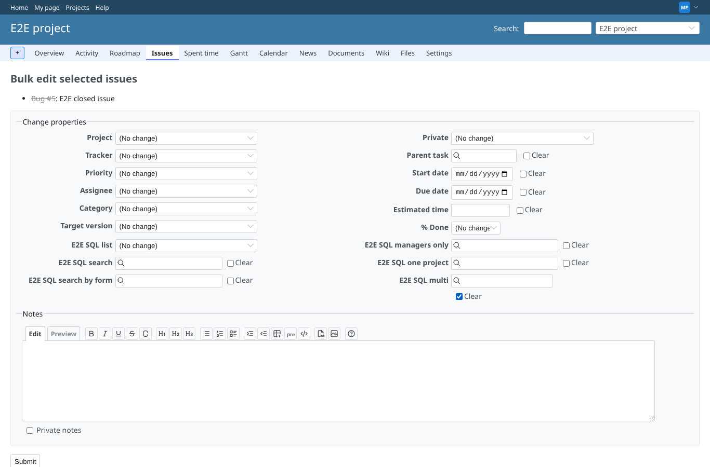 | manager | `/issues/bulk_edit?ids[]=5` | Bulk edit of "E2E closed issue": "Clear" ticked under E2E SQL multi (the input is disabled) |
| 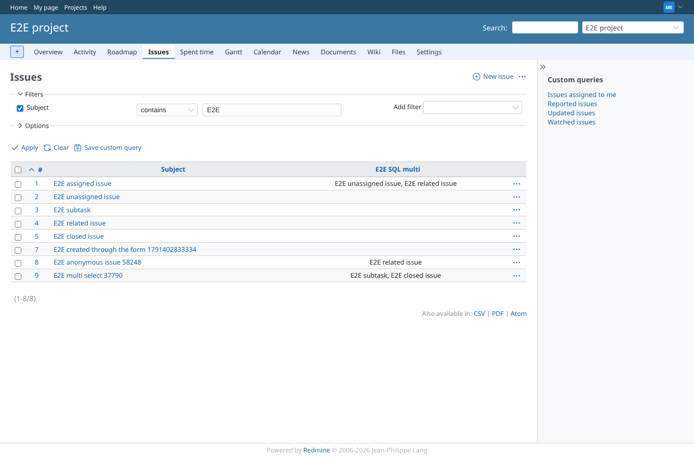 | manager | `/projects/e2e-project/issues?set_filter=1&f[]=subject&op[subject]=~&v[subject][]=E2E+&c[]=subject&c[]=cf_6&sort=id` | After "Clear": "E2E closed issue" has no E2E SQL multi any more, "E2E assigned issue" keeps its values |
| 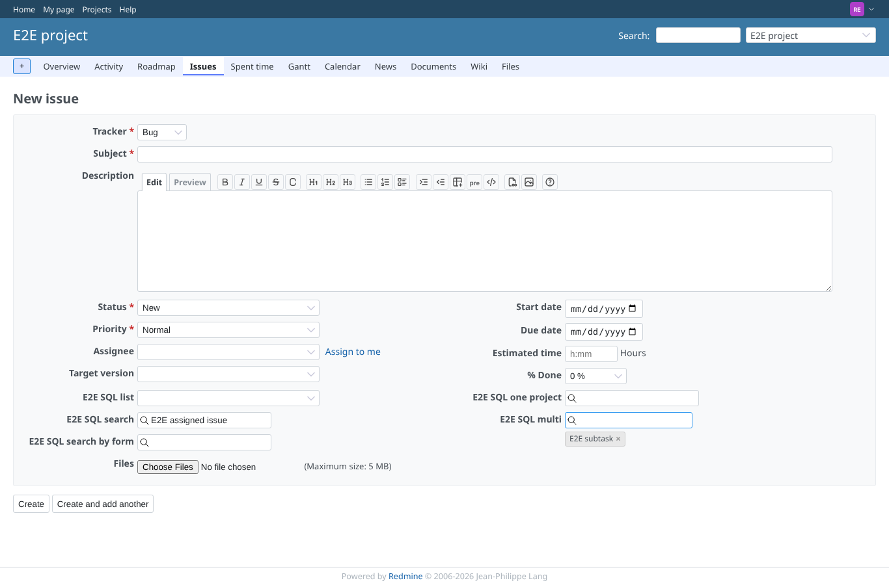 | reporter | `/projects/e2e-project/issues/new` | reporter on the new issue form of public e2e-project: the search answers (E2E subtask (3)), "E2E subtask" picked as a tag |
|  | outsider | `/projects/e2e-project/issues/new` | outsider on the new issue form of public e2e-project: the search answers (E2E subtask (3)), "E2E subtask" picked as a tag |
|  | outsider | `/projects/e2e-private/issues/new` | Outsider: the new issue form of private e2e-private is refused (403), so no multi field there |
| 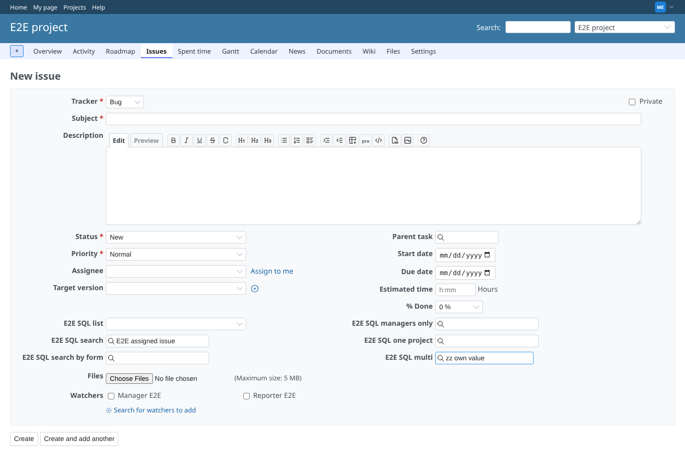 | manager | `/projects/e2e-project/issues/new` | Strict selection on: "zz own value" has no result and there is no "+"; Enter adds nothing (tags: none) |
