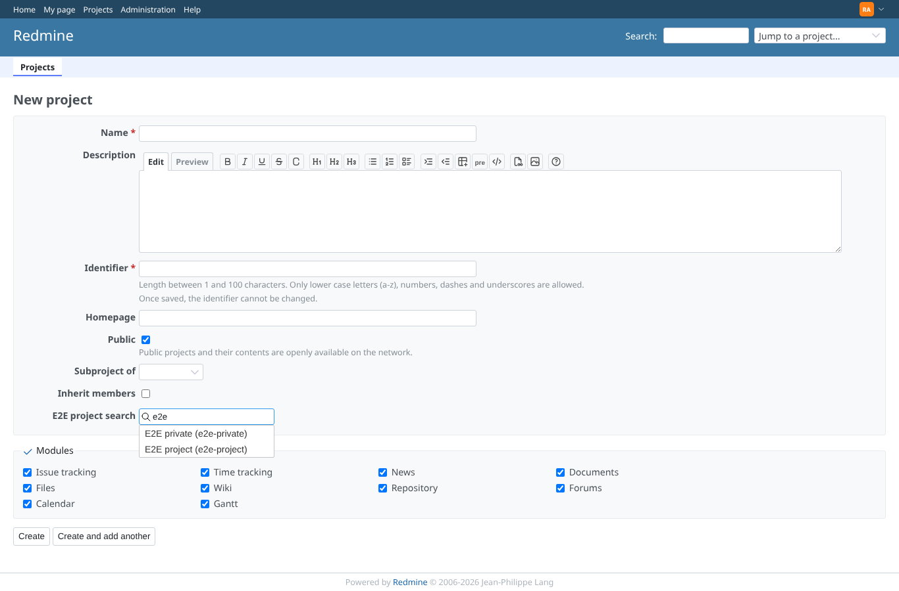
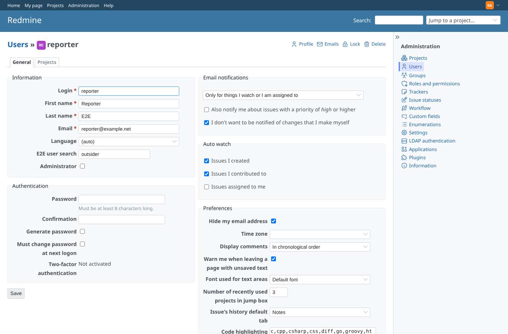
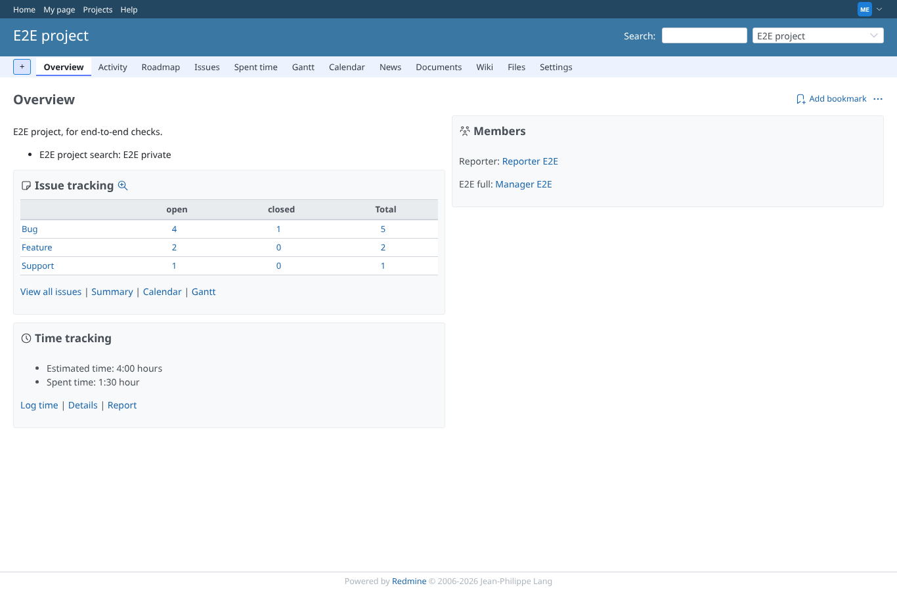
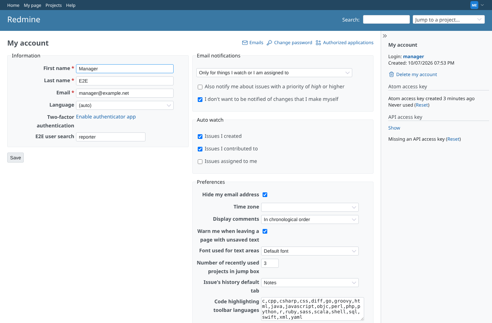
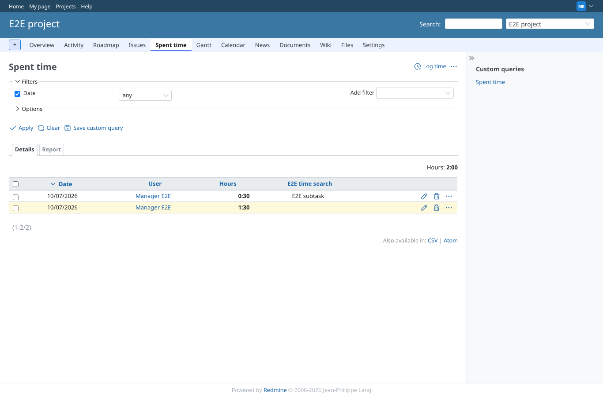
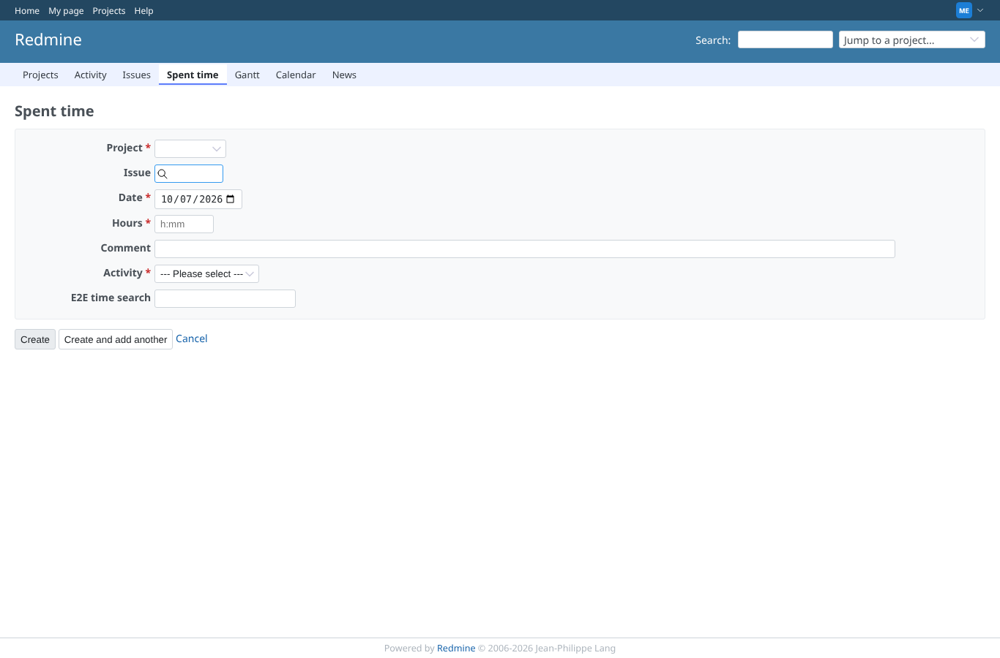
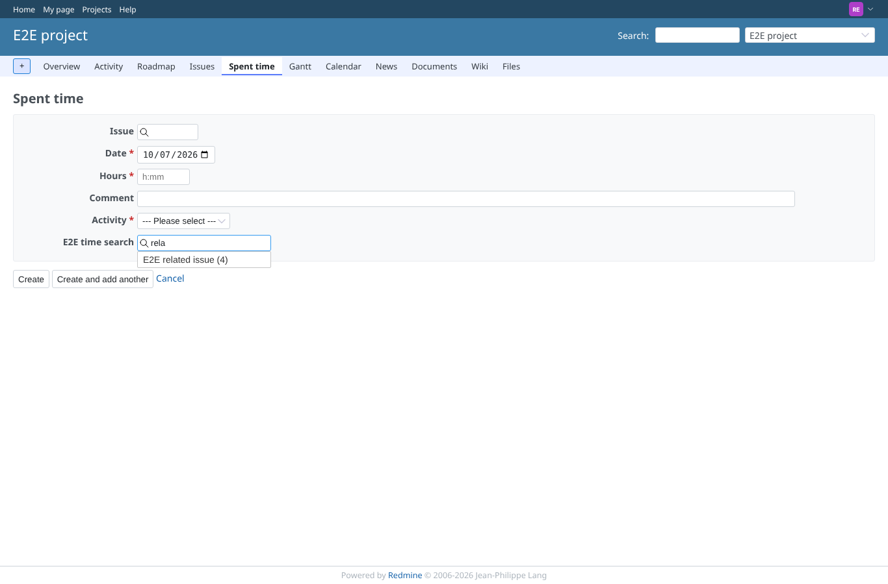
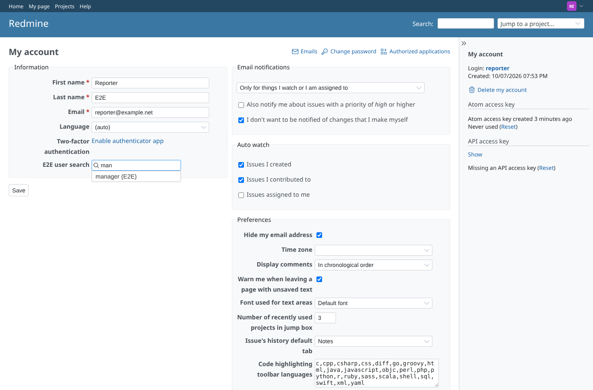

# other_fields

Run 2026-10-07T19:56:59.416Z against http://127.0.0.1:3000.

| screenshot | user | URL | shows |
|---|---|---|---|
|  | admin | `/projects/new` | Admin, new project form: the project field "E2E project search", wired by a script of one's own, lists E2E private (e2e-private) | E2E project (e2e-project) |
|  | admin | `/users/6/edit` | Admin, Users > reporter: the user field "E2E user search" listed outsider (E2E); "outsider" picked and saved |
|  | manager | `/projects/e2e-project` | Manager (edit_project), project settings: "priv" listed E2E private (e2e-private); saved, the overview shows E2E project search = E2E private |
|  | manager | `/my/account` | Manager, My account (an editable user field): "rep" listed reporter (E2E); "reporter" saved |
|  | manager | `/projects/e2e-project/time_entries?set_filter=1&c[]=spent_on&c[]=user&c[]=hours&c[]=cf_9` | Manager (log_time), Spent time > Log time: the time entry field listed E2E subtask (3); saved, the list shows E2E time search = E2E subtask |
|  | manager | `/time_entries/new` | Manager, global Log time form (no project yet): the search answers 200; the query has %{project_id} = null, so no rows |
|  | reporter | `/projects/e2e-project/settings` | Reporter (no edit_project): project settings 403, the project field search HTTP 403 |
|  | reporter | `/projects/e2e-project/time_entries/new` | Reporter (core role with log_time): the time entry field lists E2E related issue (4) |
|  | reporter | `/my/account` | Reporter, My account: the editable user field lists manager (E2E) |
|  | outsider | `/custom_sql_search/search?custom_field_id=9&project_id=e2e-project&term=e2e` | Outsider: project field on e2e-private HTTP 403, without project (may not create projects) HTTP 403; time field on e2e-project (non member, no log_time) HTTP 403 |
|  | outsider | `/my/account` | Outsider, My account: the editable user field lists admin (Admin) |
|  | manager | `/custom_sql_search/search?custom_field_id=8&term=rep` | User field no longer editable by users: the manager gets HTTP 403 (the field is gone from My account too) |
|  | anonymous | `/login?back_url=http%3A%2F%2F127.0.0.1%3A3000%2Fcustom_sql_search%2Fsearch%3Fcustom_field_id%3D8%26term%3Drep` | Anonymous: project, user and time entry fields answer 401 (as a page: the login form) |
