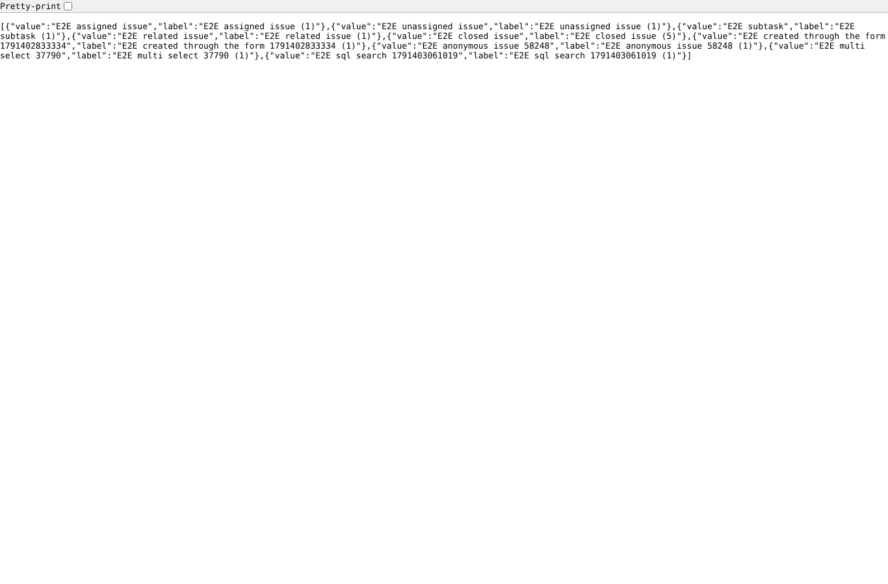
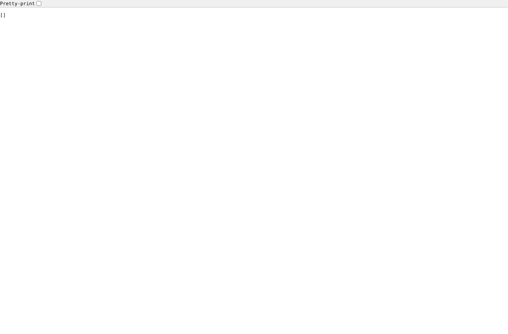
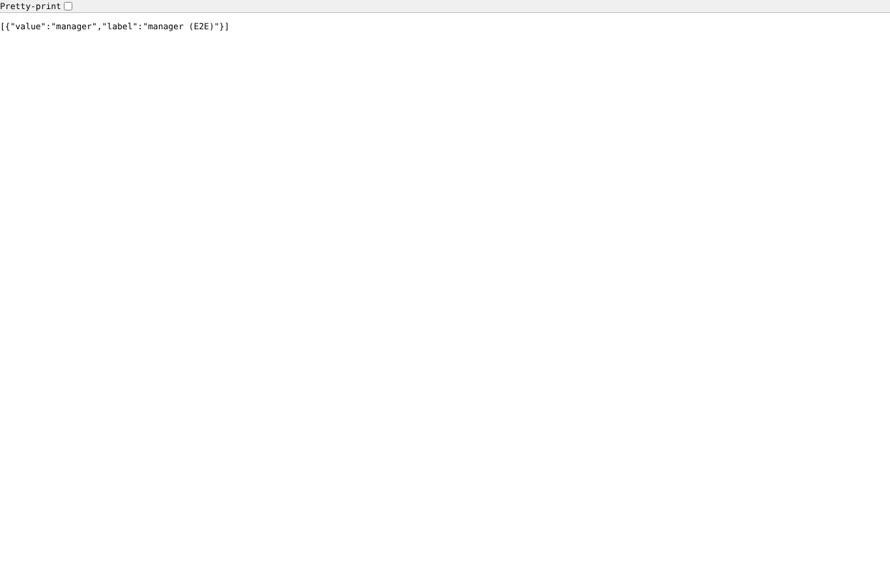
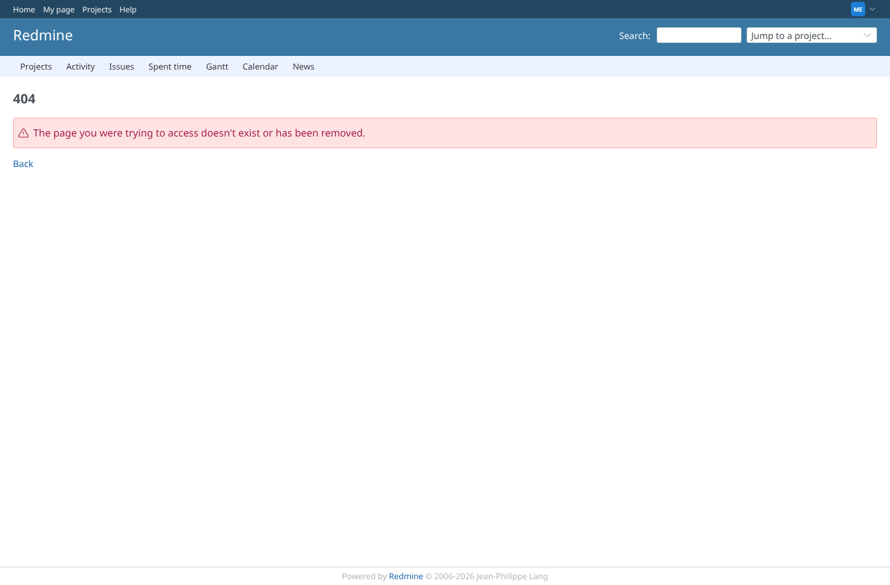
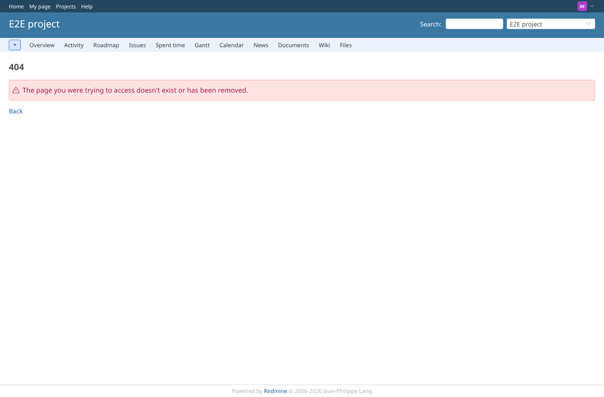

# search_authorization

Run 2026-10-07T20:49:41.463Z against http://127.0.0.1:3000.

| screenshot | user | URL | shows |
|---|---|---|---|
|  | manager | `/custom_sql_search/search?custom_field_id=2&project_id=1&issue_id=&term=E2E` | Manager, field "E2E SQL search", term E2E: the subjects of e2e-project only (XHR: HTTP 200, 9 rows; page: HTTP 200) |
|  | manager | `/custom_sql_search/search?custom_field_id=2&project_id=1&issue_id=2&term=E2E` | Manager, the edit form of an issue (issue_id given, may edit it): allowed (XHR: HTTP 200, 9 rows; page: HTTP 200) |
|  | manager | `/custom_sql_search/search?custom_field_id=2&project_id=1&issue_id=&term=zzz%27%29+union+select+login+%7C%7C+%27%3A%27+%7C%7C+hashed_password%2C+null+from+users+--` | Manager, a term that closes the quote and adds a UNION over every login and password hash (the request that leaked them before): no rows, the term stays text (XHR: HTTP 200, 0 rows; page: HTTP 200) |
|  | manager | `/custom_sql_search/search?custom_field_id=2&project_id=1&issue_id=&term=x%25%27%29+or+1%3D1+or+%28%27` | Manager, field "E2E SQL search", term `x%') or 1=1 or ('`: no rows (XHR: HTTP 200, 0 rows; page: HTTP 200) |
|  | manager | `/custom_sql_search/search?custom_field_id=3&project_id=1&issue_id=&term=E2E&p0=zzz%27+union+select+login+%7C%7C+%27%3A%27+%7C%7C+hashed_password%2C+null+from+users+--` | Manager, form parameter p0 that closes the quote and adds a UNION over every login and password hash (test users): no rows (XHR: HTTP 200, 0 rows; page: HTTP 200) |
|  | manager | `/custom_sql_search/search?custom_field_id=4&project_id=1&issue_id=&term=man` | Manager, field visible to "E2E full" only: allowed (XHR: HTTP 200, 1 rows; page: HTTP 200) |
|  | manager | `/custom_sql_search/search?custom_field_id=5&project_id=2&issue_id=&term=E2E` | Manager, field enabled for e2e-project only, asked for e2e-private: refused (XHR: HTTP 403; page: HTTP 403) |
|  | manager | `/custom_sql_search/search?custom_field_id=1&project_id=1&issue_id=&term=E2E` | Manager, the id of an "sql" list field: not found (XHR: HTTP 404; page: HTTP 404) |
|  | manager | `/custom_sql_search/search?custom_field_id=2&project_id=999999&issue_id=&term=E2E` | Manager, a project that does not exist: not found (XHR: HTTP 404; page: HTTP 404) |
|  | reporter | `/custom_sql_search/search?custom_field_id=2&project_id=1&issue_id=&term=E2E` | Reporter (core role with add issues), field "E2E SQL search": allowed (XHR: HTTP 200, 9 rows; page: HTTP 200) |
|  | reporter | `/custom_sql_search/search?custom_field_id=2&project_id=1&issue_id=2&term=E2E` | Reporter (may add, not edit issues), issue_id of a visible issue of someone else: refused (XHR: HTTP 403; page: HTTP 403) |
|  | reporter | `/custom_sql_search/search?custom_field_id=4&project_id=1&issue_id=&term=man` | Reporter, field visible to "E2E full" only: refused (XHR: HTTP 403; page: HTTP 403) |
|  | reporter | `/custom_sql_search/search?custom_field_id=2&project_id=1&issue_id=6&term=E2E` | Reporter, issue_id of private issue #6: not found (XHR: HTTP 404; page: HTTP 404) |
|  | outsider | `/custom_sql_search/search?custom_field_id=2&project_id=2&issue_id=&term=E2E` | Outsider, private project e2e-private: refused (XHR: HTTP 403; page: HTTP 403) |
|  | outsider | `/custom_sql_search/search?custom_field_id=2&project_id=1&issue_id=&term=E2E` | Outsider on public e2e-project (core role "Non member" may add issues): allowed (XHR: HTTP 200, 9 rows; page: HTTP 200) |
|  | anonymous | `/login?back_url=http%3A%2F%2F127.0.0.1%3A3000%2Fcustom_sql_search%2Fsearch%3Fcustom_field_id%3D2%26project_id%3D1%26issue_id%3D%26term%3DE2E` | Anonymous (login not required in the settings, the anonymous role may not add issues): XHR HTTP 403, the page sends to the login form; with "Add issues" see anonymous_search |
