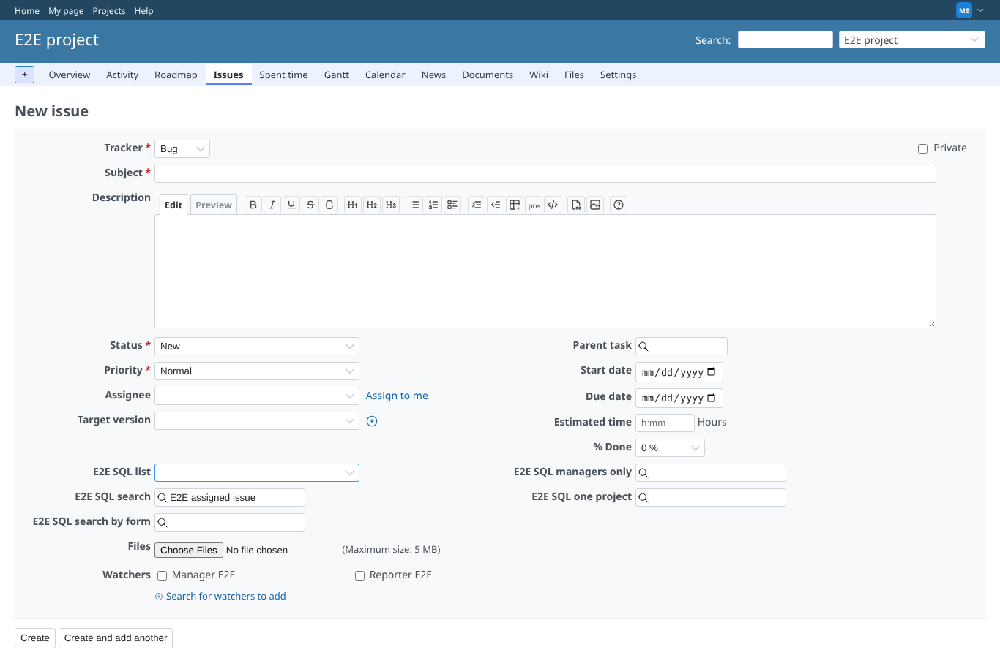
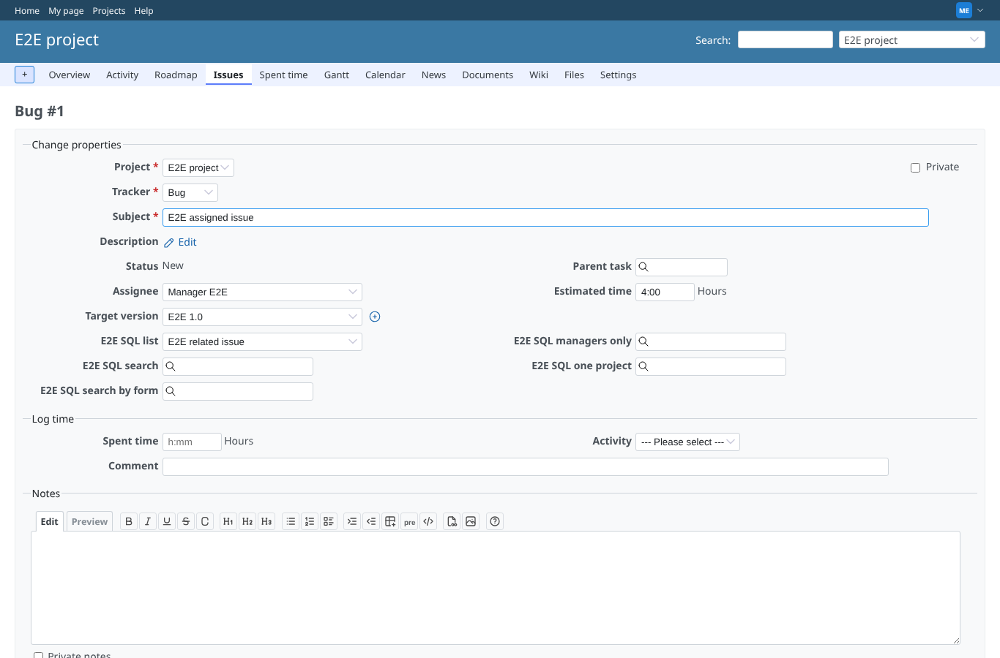
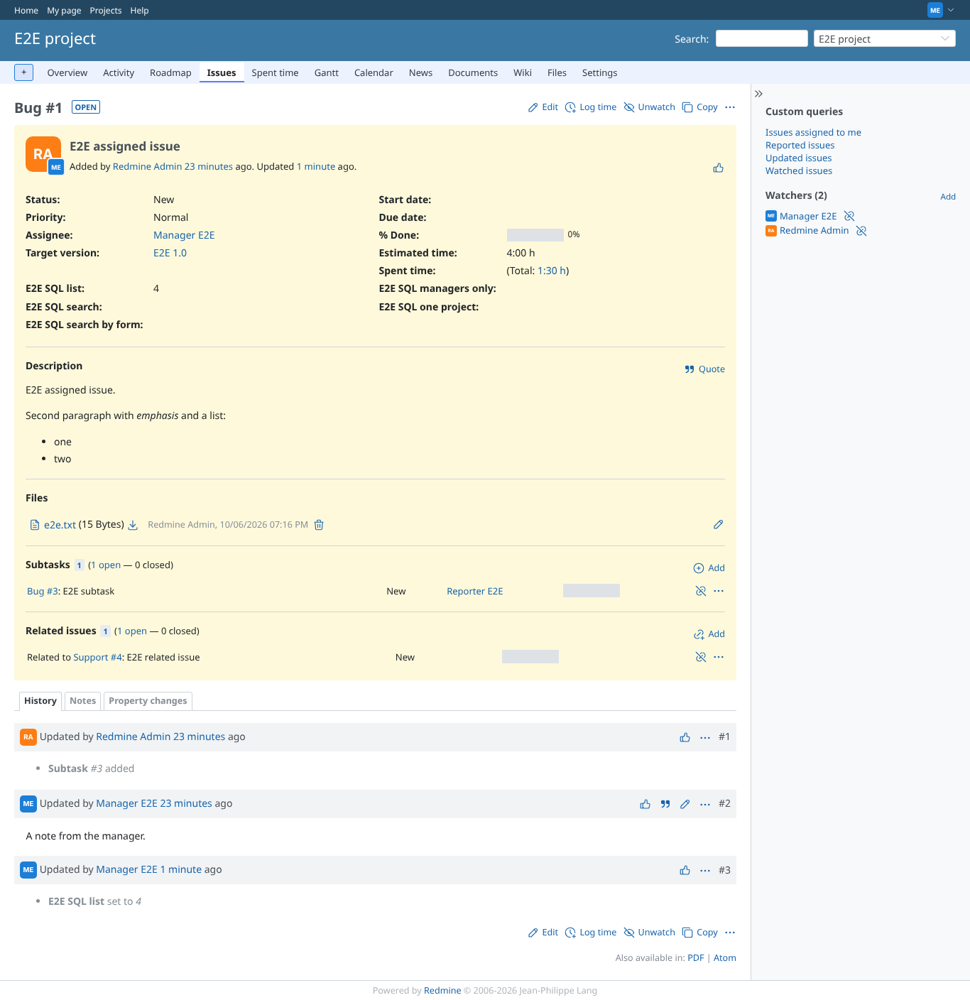
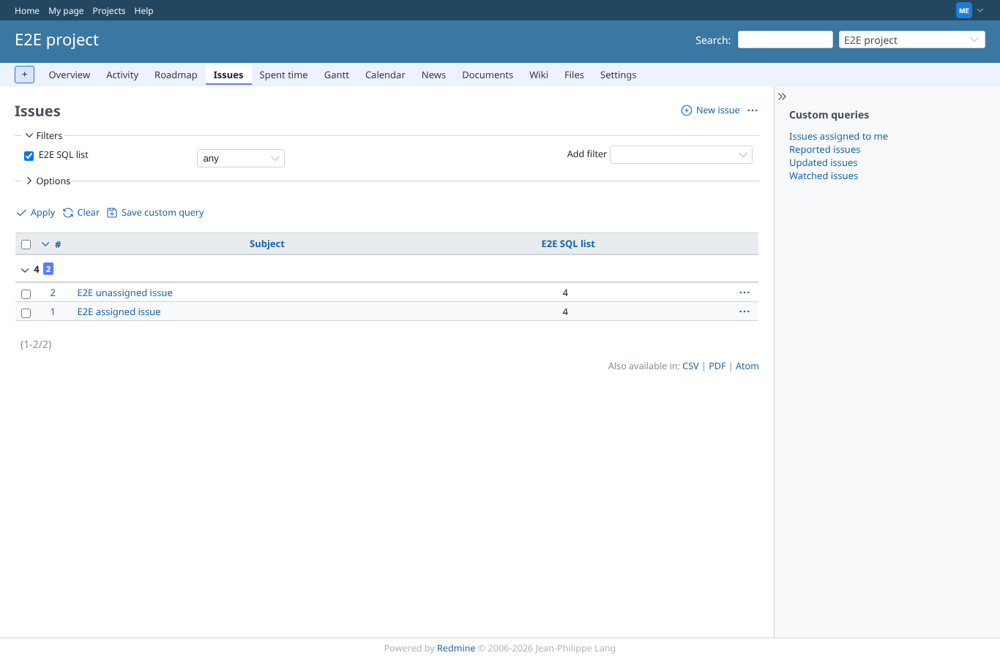
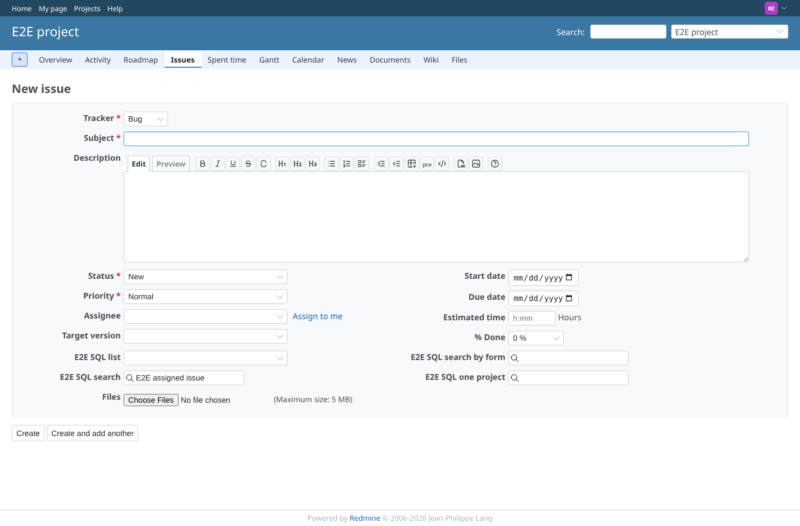

# sql_list

Run 2026-10-06T19:39:18.323Z against http://127.0.0.1:3000.

| screenshot | user | URL | shows |
|---|---|---|---|
|  | manager | `/projects/e2e-project/issues/new` | New issue: the options are the query's rows (12 issues, %id% is null) |
|  | manager | `/issues/1/edit` | Edit of #1 "E2E assigned issue": it is not in its own list (%id% = 1); "E2E related issue" (value 4) picked |
|  | manager | `/issues/1` | #1 shows the stored value 4 (the id column of the query) and the journal records the change |
|  | manager | `/projects/e2e-project/issues?set_filter=1&f[]=cf_1&op[cf_1]=*&c[]=subject&c[]=cf_1&group_by=cf_1` | Issue list filtered on "E2E SQL list" (any), with the column and grouped by it: 2 issue(s) in 1 group(s) |
|  | reporter | `/projects/e2e-project/issues/new` | Reporter: the new issue form offers the same 12 options |
|  | outsider | `/projects/e2e-private/issues/new` | Outsider: the new issue form of the private project is refused |
