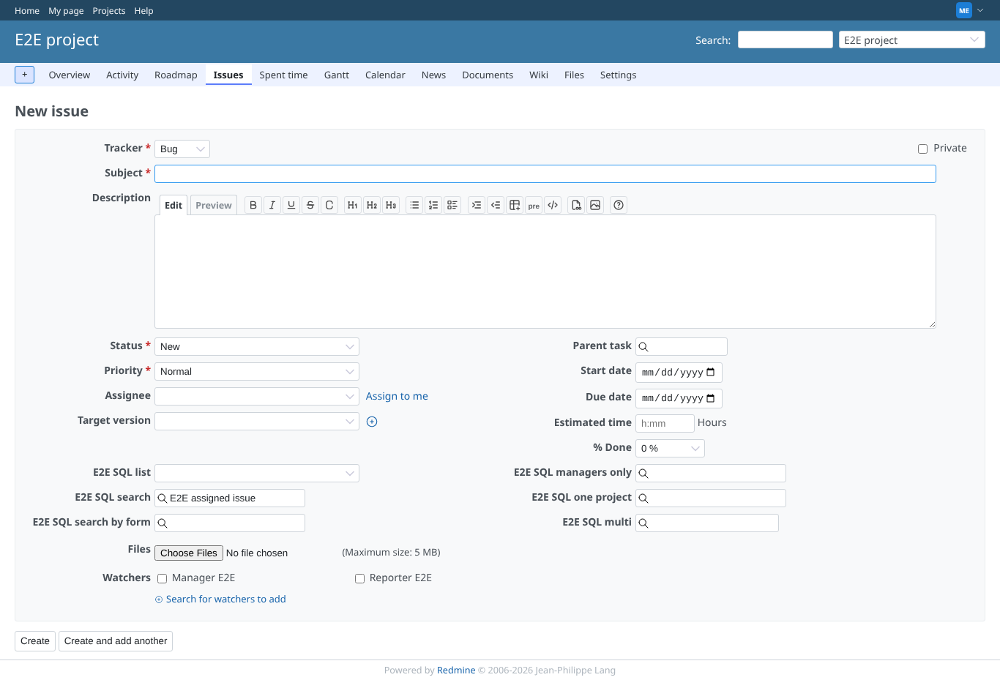
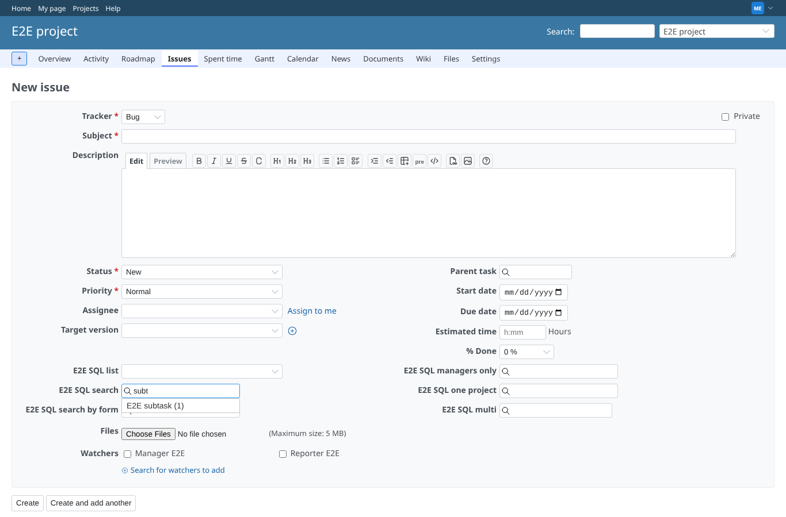
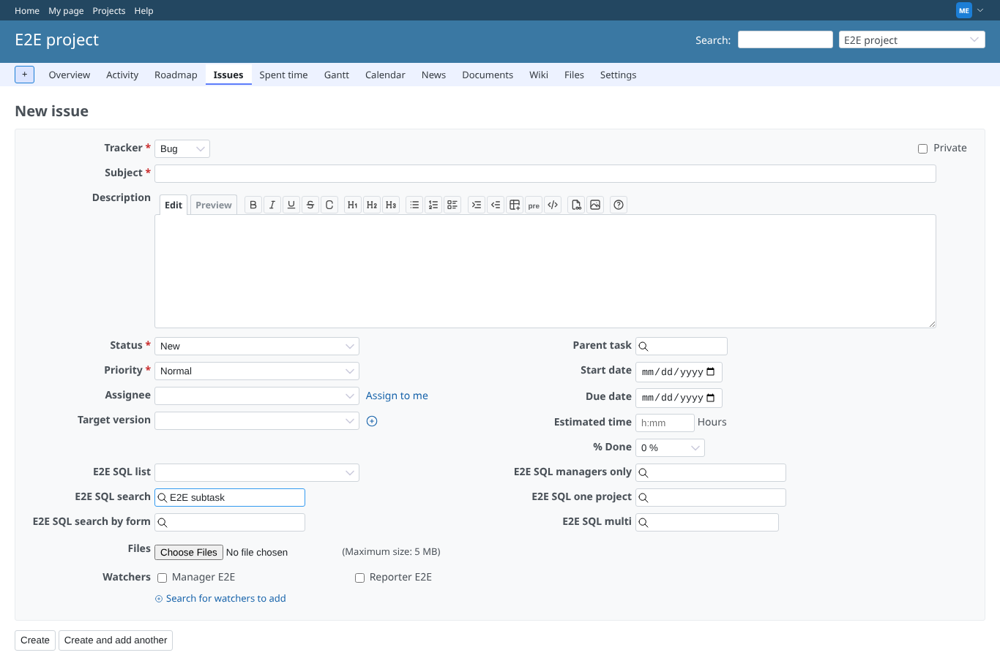
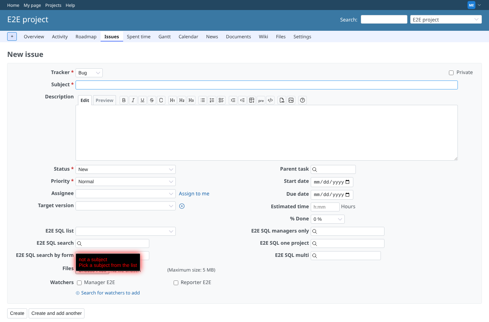
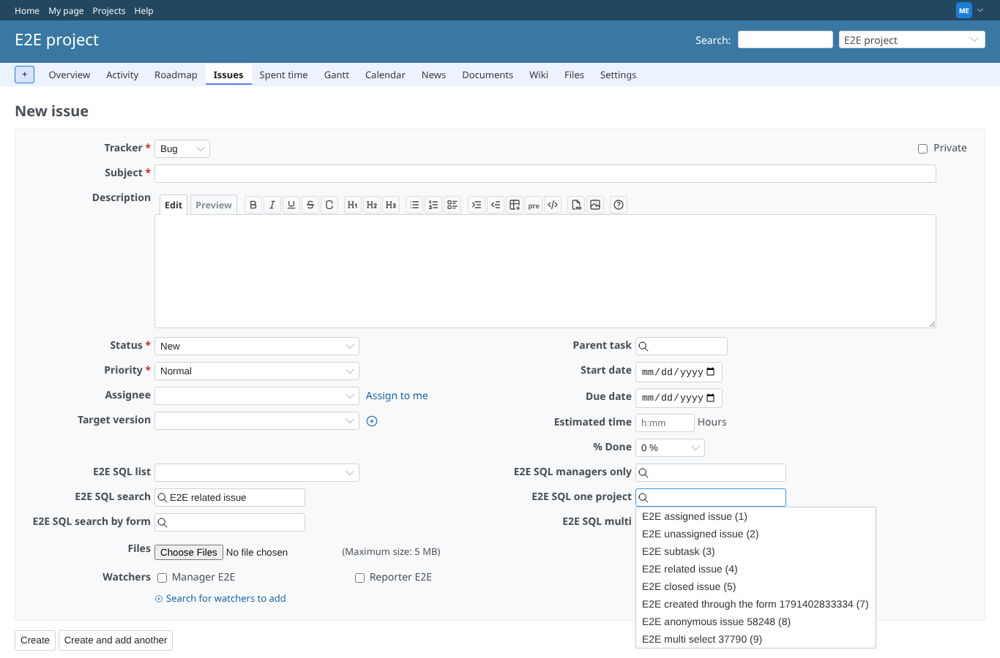
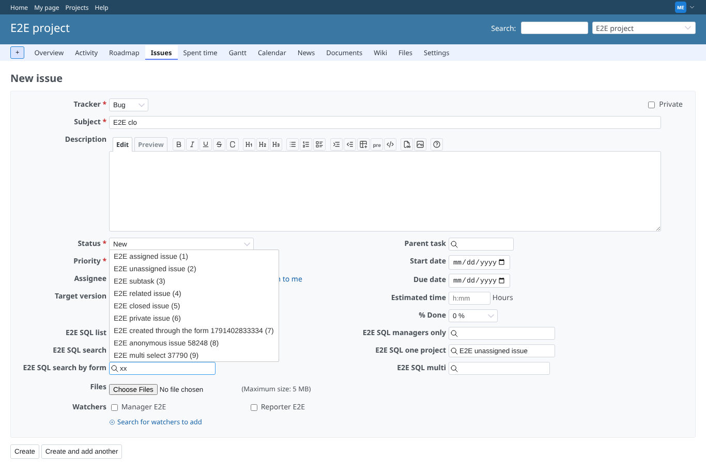
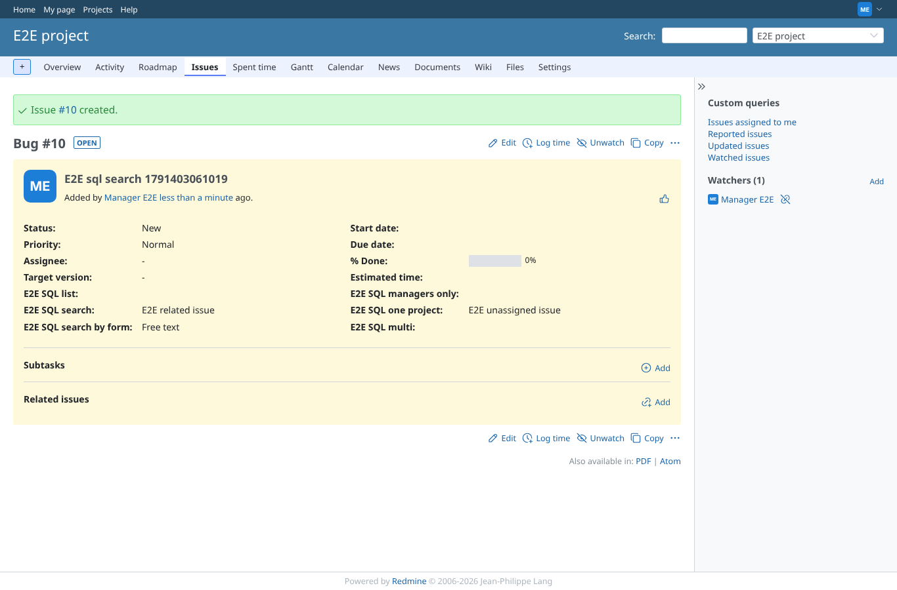
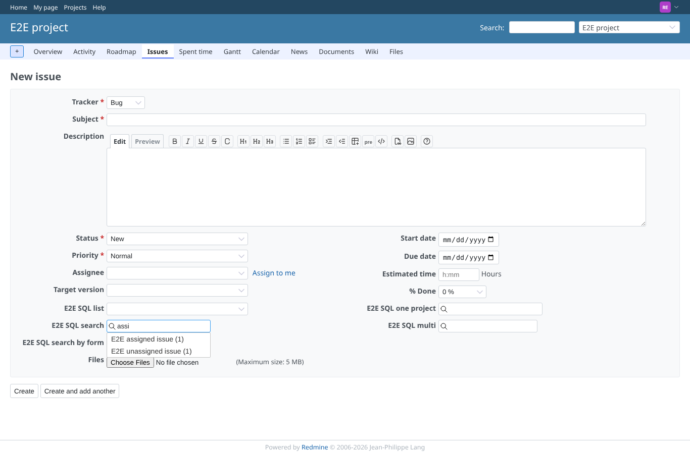

# sql_search

Run 2026-10-07T19:57:44.947Z against http://127.0.0.1:3000.

| screenshot | user | URL | shows |
|---|---|---|---|
|  | manager | `/projects/e2e-project/issues/new` | New issue: the default value query filled "E2E assigned issue" (first issue of this project and tracker) |
|  | manager | `/projects/e2e-project/issues/new` | Typing "subt" lists the matching subjects of e2e-project: E2E subtask (1) |
|  | manager | `/projects/e2e-project/issues/new` | Picking a result sets the value "E2E subtask" and the jQuery data flag edited=true (GEOxyz #6103) |
|  | manager | `/projects/e2e-project/issues/new` | Strict selection: "not a subject" is cleared and the tooltip says "not a subject Pick a subject from the list" |
|  | manager | `/projects/e2e-project/issues/new` | Search by click: a click on the empty field lists 8 issues of e2e-project without typing |
|  | manager | `/projects/e2e-project/issues/new` | Form parameter p0 is built from the subject "E2E clo" ('E2E' + '%'): 9 results |
|  | manager | `/issues/10` | The issue is saved with the picked values and the free text |
|  | reporter | `/projects/e2e-project/issues/new` | Reporter (core role, may add issues) gets results; the field visible to "E2E full" only is not on the form |
