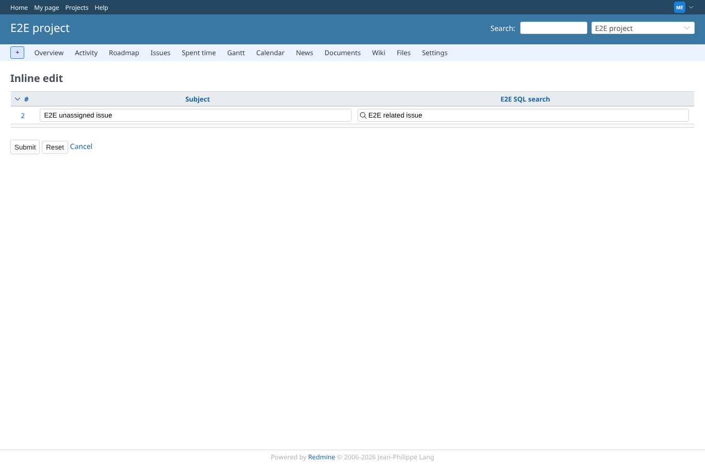
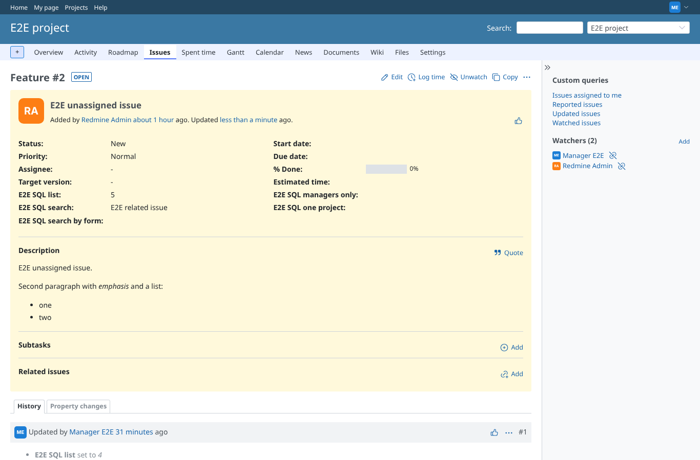

# inline_edit

Run 2026-10-06T20:08:54.851Z against http://127.0.0.1:3000.

| screenshot | user | URL | shows |
|---|---|---|---|
|  | manager | `/projects/e2e-project/inline_issues/edit_multiple?set_filter=1&f[]=subject&op[subject]=~&v[subject][]=E2E+unassigned&c[]=subject&c[]=cf_2` | Inline edit (redmine_inline_edit_issues): after picking and leaving the field the value stays "E2E related issue" (edited=true, GEOxyz #6103) |
|  | manager | `/issues/2` | Saved through the inline edit form: #2 shows E2E SQL search = E2E related issue |
