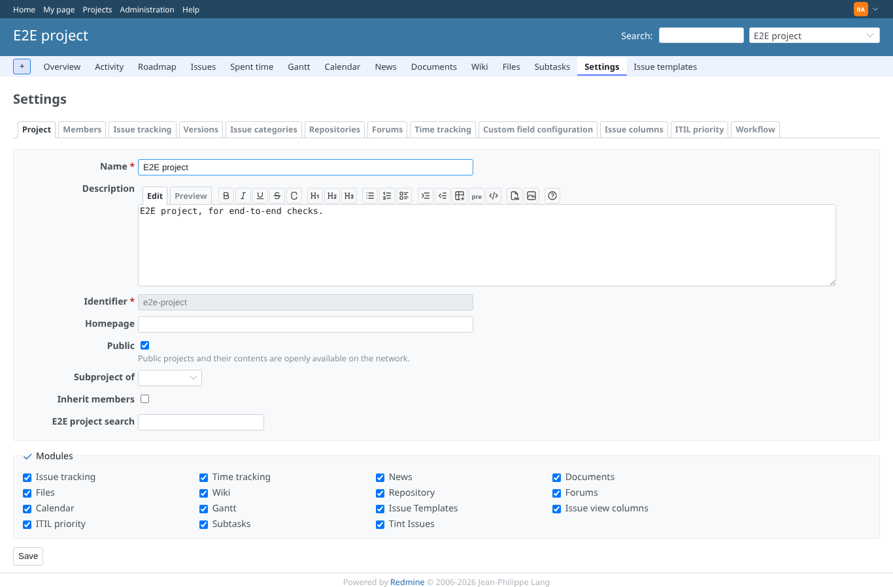
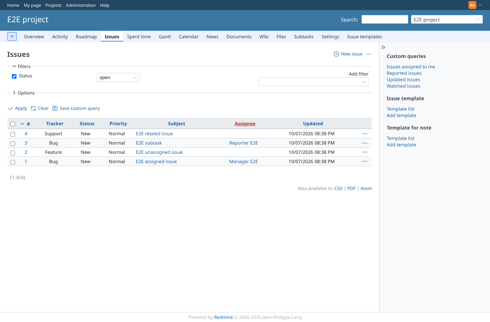
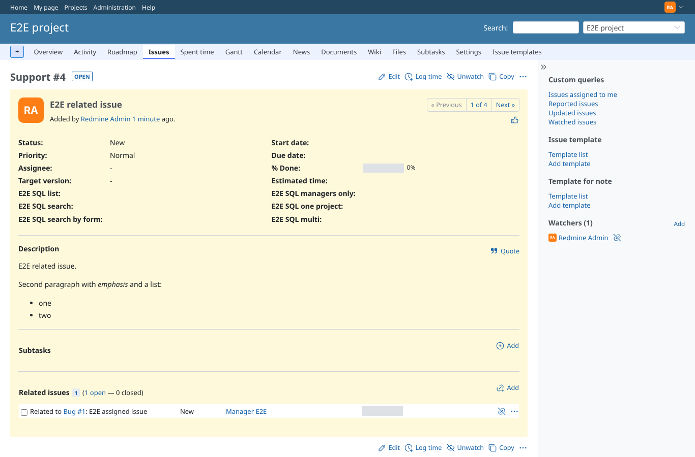
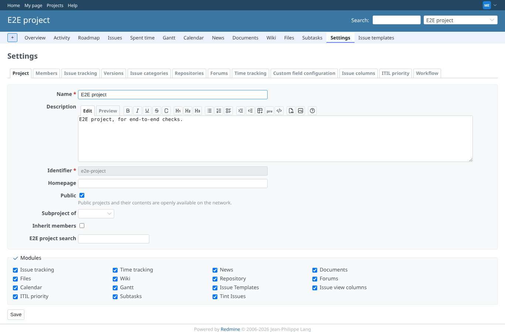
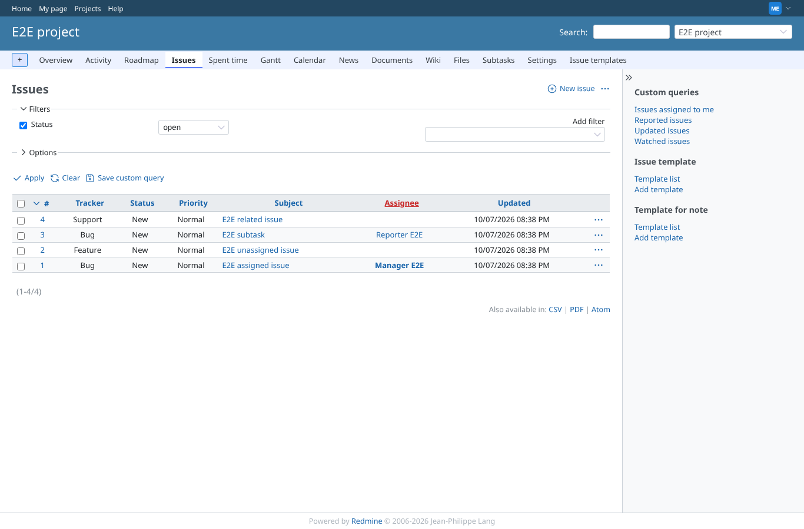
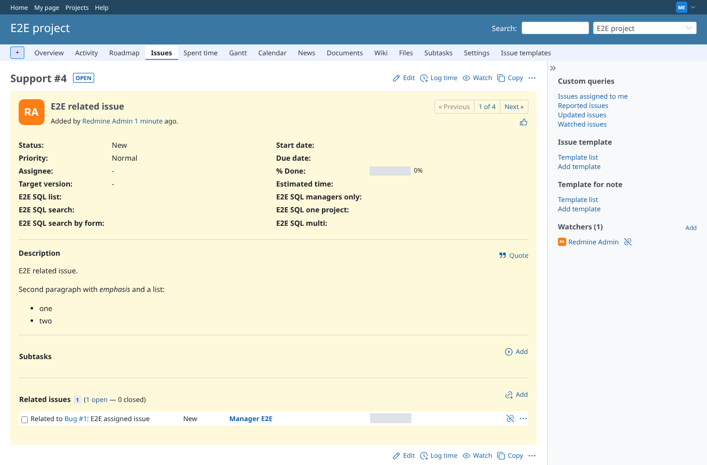
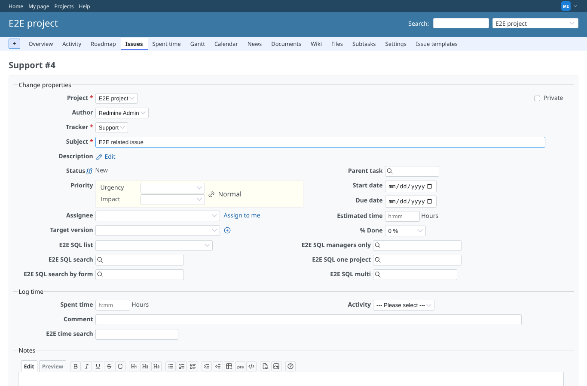

# pages

Run 2026-10-07T20:39:07.969Z against http://127.0.0.1:3000.

| screenshot | user | URL | shows |
|---|---|---|---|
|  | admin | `/projects/e2e-project/settings` | admin: Project > Settings answers 200 with 16 other GEOxyz plugins installed |
|  | admin | `/projects/e2e-project/issues` | admin: the issue list answers 200 |
|  | admin | `/issues/4` | admin: an issue page (/issues/4) answers 200 |
|  | admin | `/issues/4/edit` | admin: its edit form answers 200, the sql_search fields are wired (observeSqlField/observeSqlMultiField) |
|  | manager | `/projects/e2e-project/settings` | manager: Project > Settings answers 200 with 16 other GEOxyz plugins installed |
|  | manager | `/projects/e2e-project/issues` | manager: the issue list answers 200 |
|  | manager | `/issues/4` | manager: an issue page (/issues/4) answers 200 |
|  | manager | `/issues/4/edit` | manager: its edit form answers 200, the sql_search fields are wired (observeSqlField/observeSqlMultiField) |
