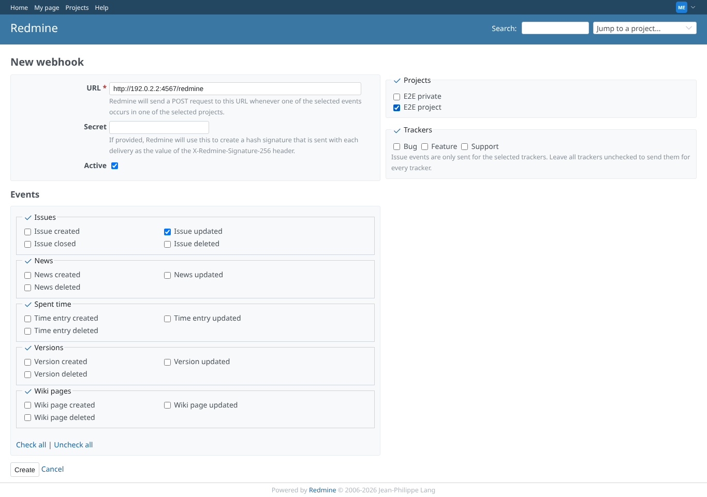
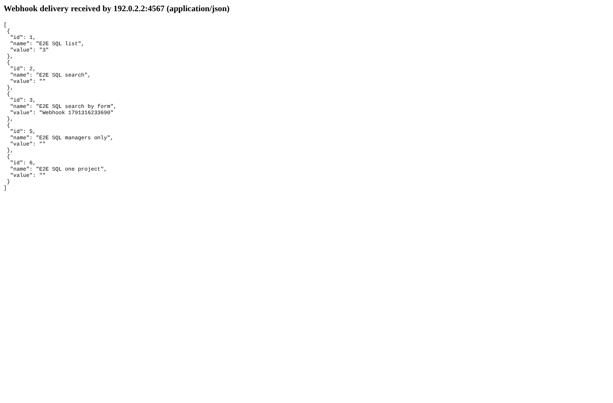

# webhook

Run 2026-10-06T19:50:39.808Z against http://127.0.0.1:3000.

| screenshot | user | URL | shows |
|---|---|---|---|
|  | manager | `/webhooks/new` | The manager creates a webhook for issue.updated in e2e-project to http://192.0.2.2:4567/redmine |
|  | manager | `/issues/5` | The issue.updated delivery carries both plugin fields as plain values: E2E SQL list = 3, E2E SQL search by form = "Webhook 1791316233690" (full payload: webhook-payload.json) |
